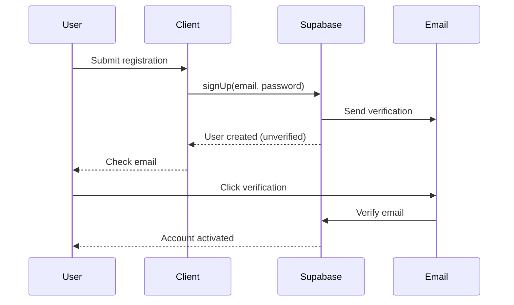
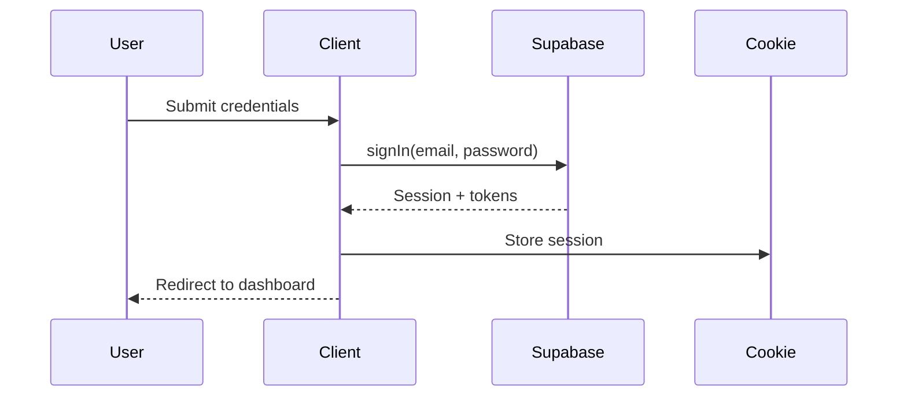

# Complete Authentication Configuration Documentation

This document consolidates all authentication configuration information for the User Management module, including environment setup, role structure, provider configuration, and migration guidance.

---

## Table of Contents
1. [Authentication Architecture](#authentication-architecture)
2. [Environment Configuration](#environment-configuration)
3. [Authentication Flow](#authentication-flow)
4. [Role & Permission Structure](#role--permission-structure)
5. [Provider Configuration](#provider-configuration)
6. [Migration Guide](#migration-guide)
7. [Troubleshooting](#troubleshooting)

---

## Authentication Architecture

The authentication system uses a provider-based architecture with Supabase as the default implementation. The system is designed to be database-agnostic through the `AuthDataProvider` interface.

### Core Components

- **AuthDataProvider Interface** - Abstraction layer for authentication providers
- **SupabaseAuthProvider** - Default implementation using Supabase Auth
- **authEnvironment Module** - Centralized environment variable management
- **withRouteAuth Middleware** - Route protection and user context injection

### Key Files

```
src/
├── lib/auth/
│   ├── authEnvironment.ts      # Environment configuration
│   └── withRouteAuth.ts        # Route authentication middleware
├── adapters/auth/
│   ├── factory.ts               # Provider factory
│   └── providers/
│       └── supabase-auth-provider.ts
└── services/auth/
    └── auth-service.ts          # Business logic layer
```

---

## Environment Configuration

### Required Environment Variables

| Variable | Description | Required | Default |
|----------|-------------|----------|---------|
| `NEXT_PUBLIC_SUPABASE_URL` | Supabase project URL | Yes | - |
| `NEXT_PUBLIC_SUPABASE_ANON_KEY` | Public anon key for browser | Yes | - |
| `SUPABASE_SERVICE_ROLE_KEY` | Service role key for server operations | No* | - |
| `SUPABASE_AUTH_COOKIE_NAME` | Session cookie name | No | `sb-access-token` |
| `SUPABASE_AUTH_COOKIE_LIFETIME_DAYS` | Session lifetime in days | No | `7` |
| `SUPABASE_AUTO_REFRESH_TOKEN` | Enable automatic token refresh | No | `true` |
| `SUPABASE_PERSIST_SESSION` | Persist session across tabs | No | `true` |
| `SESSION_COOKIE_NAME` | Legacy cookie name (deprecated) | No | - |
| `TOKEN_EXPIRY_DAYS` | Refresh token lifetime | No | `30` |

*Required for server-side operations like admin functions

### Environment Validation

Use the validation utility at startup to ensure proper configuration:

```typescript
import { validateAuthEnv } from '@/lib/auth/authEnvironment';

// In app initialization
if (!validateAuthEnv()) {
  throw new Error('Invalid authentication configuration');
}
```

### Configuration Helpers

```typescript
import {
  authEnv,
  getSupabaseClientConfig,
  getSupabaseServerConfig
} from '@/lib/auth/authEnvironment';

// Get validated config for client
const clientConfig = getSupabaseClientConfig();

// Get validated config for server (includes service role)
const serverConfig = getSupabaseServerConfig();
```

---

## Authentication Flow

### 1. Registration Flow



### 2. Login Flow



### 3. Session Management

- **Initial Login**: Creates session cookie with access/refresh tokens
- **Auto Refresh**: When `SUPABASE_AUTO_REFRESH_TOKEN=true`, tokens refresh automatically before expiry
- **Manual Refresh**: Call `refreshSession()` to force token refresh
- **Logout**: Calls `signOut()` to invalidate server session and clear cookies

### 4. Protected Routes

```typescript
// API Route Protection
export async function GET(request: Request) {
  const { user, error } = await withRouteAuth(request, {
    includeUser: true,
    requiredPermissions: ['admin.read']
  });
  
  if (error) return error; // Returns 401/403 response
  
  // Route logic with authenticated user
}
```

---

## Role & Permission Structure

### User Object Structure

The authenticated user object combines Supabase auth data with custom application metadata:

```typescript
interface AuthenticatedUser {
  // Supabase auth fields
  id: string;
  email: string;
  role: 'authenticated';  // Supabase role (always 'authenticated')
  
  // Custom application data
  app_metadata: {
    role: string;         // Custom role (admin, user, etc.)
    permissions?: string[];  // Cached permissions
    organizationId?: string; // Organization context
  };
  
  // Profile data
  user_metadata: {
    firstName?: string;
    lastName?: string;
    avatar?: string;
  };
}
```

### Permission Extraction Flow

1. **Token Metadata** (Fast Path):
   ```typescript
   // Permissions stored in JWT for quick access
   const permissions = user.app_metadata.permissions || [];
   ```

2. **Database Lookup** (Fallback):
   ```typescript
   // If not in token, query permission service
   const permissions = await permissionService.getUserPermissions(user.id);
   ```

3. **Role-Based Defaults**:
   ```typescript
   // Apply role-based permission sets
   const rolePermissions = await roleService.getRolePermissions(user.app_metadata.role);
   ```

### Custom Role Management

```typescript
// Setting custom role during registration
await supabase.auth.signUp({
  email,
  password,
  options: {
    data: {
      firstName,
      lastName,
    },
    // Admin must set app_metadata via service role
  }
});

// Updating role (requires service role key)
await supabase.auth.admin.updateUserById(userId, {
  app_metadata: { role: 'admin' }
});
```

---

## Provider Configuration

### Default Supabase Provider

```typescript
import { createAuthProvider } from '@/adapters/auth/factory';

const authProvider = createAuthProvider({
  type: 'supabase',
  options: {
    supabaseUrl: process.env.NEXT_PUBLIC_SUPABASE_URL,
    supabaseKey: process.env.NEXT_PUBLIC_SUPABASE_ANON_KEY,
    serviceRoleKey: process.env.SUPABASE_SERVICE_ROLE_KEY,
  },
});
```

### Custom Provider Implementation

Implement the `AuthDataProvider` interface for custom providers:

```typescript
interface AuthDataProvider {
  // Authentication
  signIn(credentials: SignInCredentials): Promise<AuthResponse>;
  signUp(credentials: SignUpCredentials): Promise<AuthResponse>;
  signOut(): Promise<void>;
  
  // Session management
  getSession(): Promise<Session | null>;
  refreshSession(): Promise<Session | null>;
  
  // User management
  getUser(): Promise<User | null>;
  updateUser(updates: UserUpdates): Promise<User>;
  
  // Password management
  resetPassword(email: string): Promise<void>;
  updatePassword(newPassword: string): Promise<void>;
  
  // OAuth
  signInWithOAuth(provider: OAuthProvider): Promise<AuthResponse>;
  linkOAuthAccount(provider: OAuthProvider): Promise<void>;
}
```

### Provider Registration

Register custom providers in the adapter registry:

```typescript
// src/adapters/registry.ts
import { CustomAuthProvider } from './custom-auth-provider';

AdapterRegistry.register('auth', 'custom', CustomAuthProvider);
```

---

## Migration Guide

### From NextAuth to Supabase

1. **Update Environment Variables**:
   ```bash
   # Remove NextAuth variables
   - NEXTAUTH_URL
   - NEXTAUTH_SECRET
   
   # Add Supabase variables
   + NEXT_PUBLIC_SUPABASE_URL
   + NEXT_PUBLIC_SUPABASE_ANON_KEY
   + SUPABASE_SERVICE_ROLE_KEY
   ```

2. **Replace Authentication Calls**:
   ```typescript
   // Before (NextAuth)
   import { signIn } from 'next-auth/react';
   await signIn('credentials', { email, password });
   
   // After (Supabase)
   import { supabase } from '@/lib/supabase/client';
   await supabase.auth.signInWithPassword({ email, password });
   ```

3. **Update Session Handling**:
   ```typescript
   // Before (NextAuth)
   import { useSession } from 'next-auth/react';
   const { data: session } = useSession();
   
   // After (Supabase)
   import { useAuth } from '@/hooks/auth/useAuth';
   const { user, session } = useAuth();
   ```

4. **Migrate Protected Routes**:
   ```typescript
   // Before (NextAuth)
   import { getServerSession } from 'next-auth';
   const session = await getServerSession(authOptions);
   
   // After (Supabase)
   import { withRouteAuth } from '@/lib/auth/withRouteAuth';
   const { user } = await withRouteAuth(request);
   ```

### Legacy Cookie Support

The system maintains backward compatibility with legacy session cookies:

```typescript
// Reads both old and new cookie names during transition
const cookieName = process.env.SUPABASE_AUTH_COOKIE_NAME || 
                  process.env.SESSION_COOKIE_NAME || 
                  'sb-access-token';
```

Remove `SESSION_COOKIE_NAME` after all users have migrated to new sessions.

---

## Troubleshooting

### Common Issues & Solutions

#### Missing Environment Variables
```typescript
// Run validation to identify missing vars
import { validateSupabaseAuthConfig } from '@/lib/auth/validation';
validateSupabaseAuthConfig(); // Logs missing variables
```

#### Session Not Persisting
- Check `SUPABASE_AUTH_COOKIE_NAME` is consistent across environments
- Verify `SUPABASE_AUTH_COOKIE_LIFETIME_DAYS` is appropriate
- Ensure `SUPABASE_PERSIST_SESSION=true` for cross-tab persistence
- Check cookie domain settings for subdomain issues

#### OAuth Errors
- Verify OAuth provider configuration in Supabase dashboard
- Check redirect URLs match environment
- Ensure provider credentials are correct
- Review CORS settings for client-side auth

#### Unexpected Sign-outs
- Confirm `SUPABASE_AUTO_REFRESH_TOKEN=true`
- Check server time synchronization (JWT validation)
- Verify token expiry settings are reasonable
- Review refresh token rotation settings

#### Permission Denied Errors
- Check user's `app_metadata.role` is set correctly
- Verify permissions are properly cached in token
- Ensure permission service is queried as fallback
- Review role-permission mappings in database

### Debug Utilities

```typescript
// Enable auth debug logging
import { enableAuthDebug } from '@/lib/auth/debug';
enableAuthDebug(true);

// Check current auth state
import { debugAuthState } from '@/lib/auth/debug';
const state = await debugAuthState();
console.log('Auth State:', state);

// Validate token manually
import { validateToken } from '@/lib/auth/validation';
const isValid = await validateToken(token);
```

### Health Checks

```typescript
// Verify auth service health
const health = await authService.healthCheck();
/*
{
  status: 'healthy',
  provider: 'supabase',
  sessionActive: true,
  tokenValid: true,
  refreshAvailable: true
}
*/
```

---

## Security Considerations

1. **Never expose `SUPABASE_SERVICE_ROLE_KEY`** in client code
2. **Use HTTPS** in production for secure cookie transmission
3. **Set secure cookie flags** in production environments
4. **Implement rate limiting** on authentication endpoints
5. **Monitor failed authentication attempts** for security threats
6. **Rotate service role keys** periodically
7. **Use Row Level Security (RLS)** in Supabase for data protection
8. **Implement CSRF protection** on state-changing operations

---

## Best Practices

1. **Environment-Specific Config**: Use different Supabase projects for dev/staging/prod
2. **Token Refresh Strategy**: Set refresh window to 80% of token lifetime
3. **Permission Caching**: Store frequently-checked permissions in token metadata
4. **Audit Logging**: Log all authentication events for security analysis
5. **Error Handling**: Never expose why authentication failed to prevent enumeration
6. **Session Management**: Implement "remember me" via cookie lifetime settings
7. **Multi-Factor Auth**: Enable MFA for sensitive operations
8. **Password Policy**: Enforce strong passwords via Supabase auth settings

---

*This consolidated document replaces: auth-config.md, auth-roles.md, and authentication-setup.md*