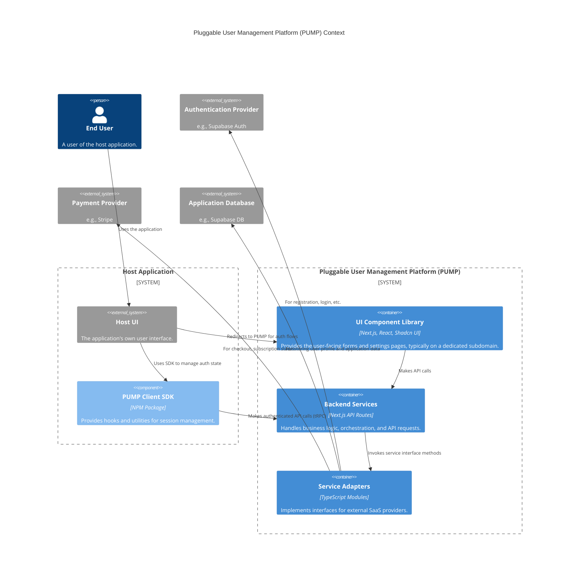
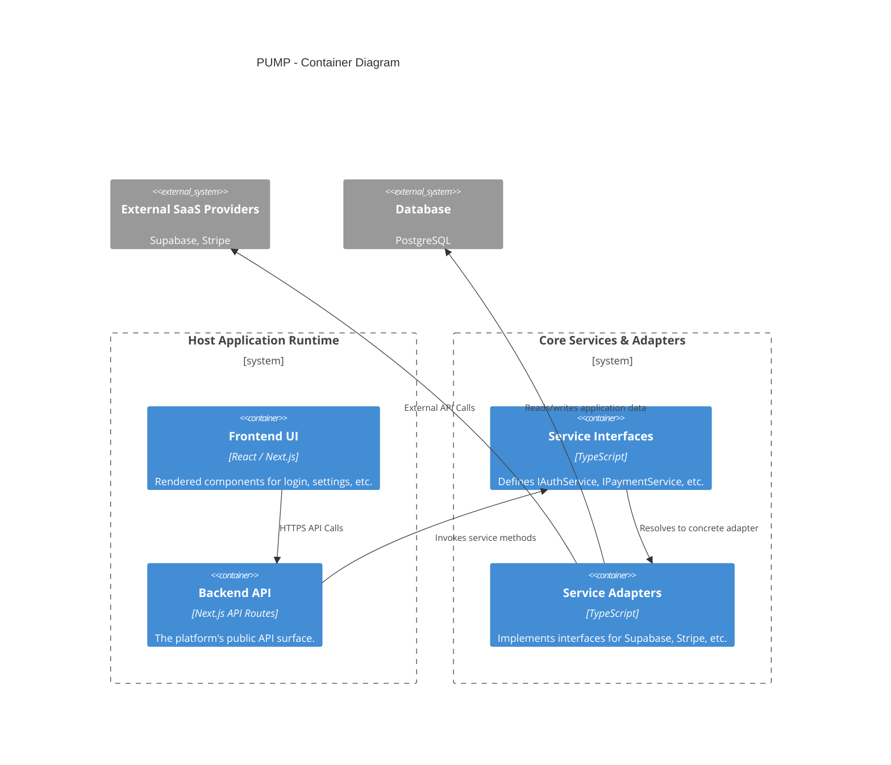
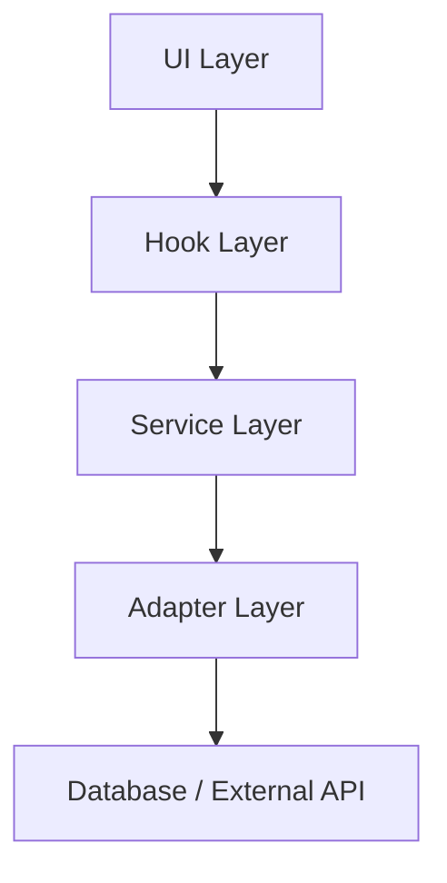
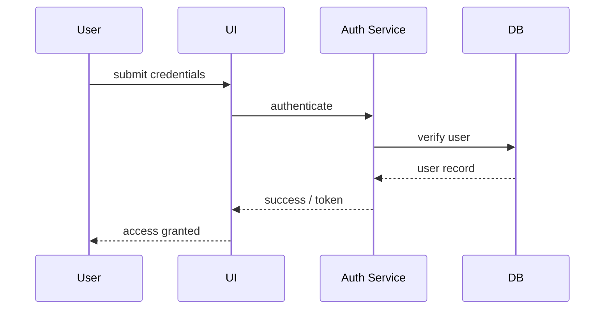
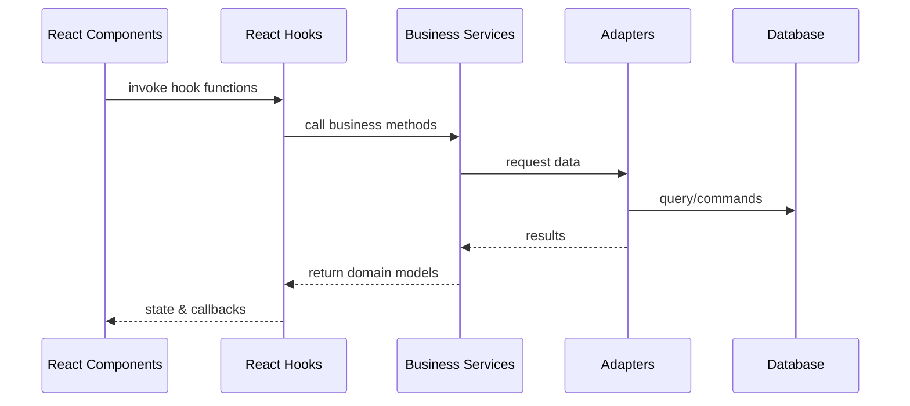
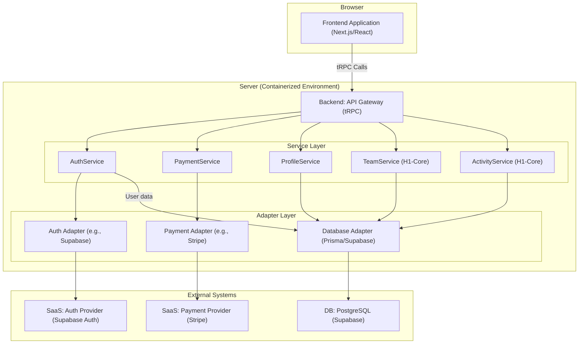
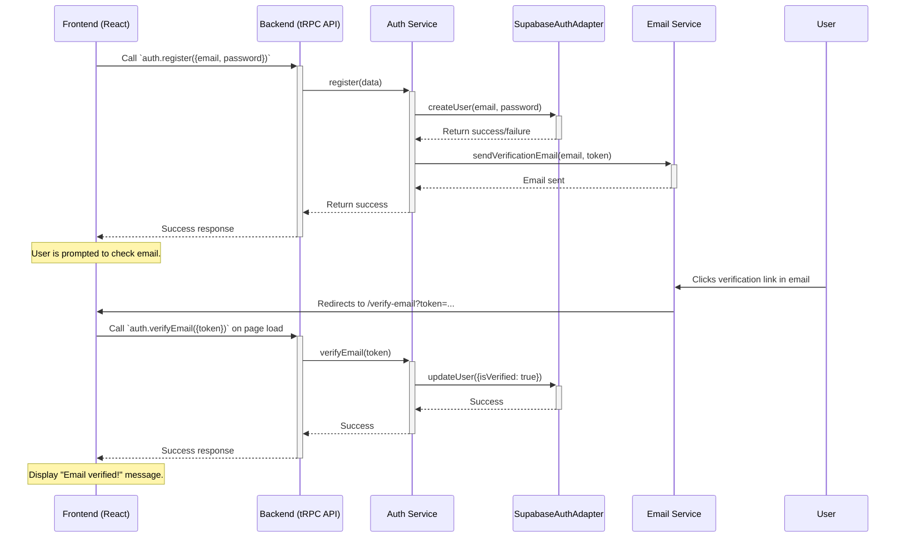
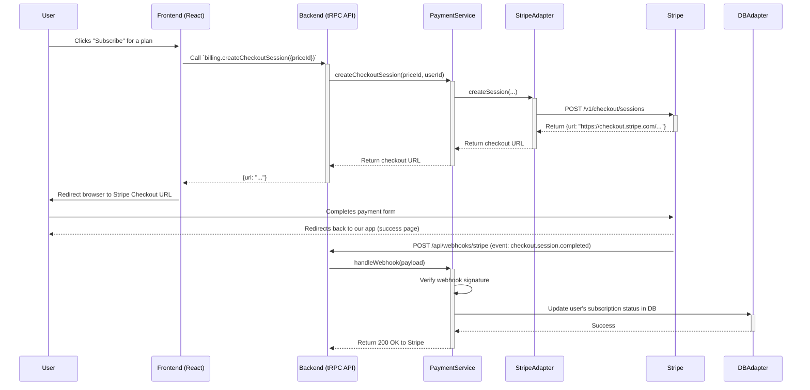
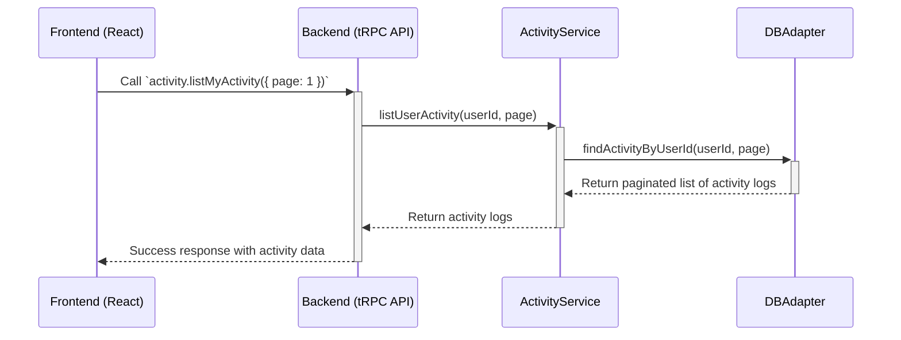
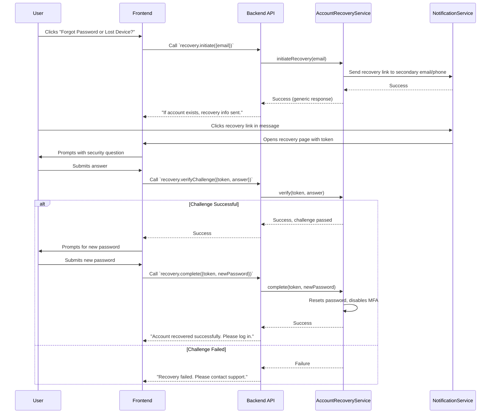

# Architecture Specification: Pluggable User Management Platform (PUMP)

**Version:** 1.0
**Status:** APPROVED

## 1. Table of Contents
- 1. Table of Contents
- 2. Introduction
- 3. Technical Summary
- 4. Core Architectural Principles
- 5. High-Level Architecture (C4 Model)
- 6. Architectural / Design Patterns Adopted
- 7. Component View
- 8. Host Integration & Pluggability Strategy
- 9. Project Structure
- 10. API Reference
- 11. Data Models
- 12. Core Workflow / Sequence Diagrams
- 13. Definitive Tech Stack Selections
- 14. Infrastructure and Deployment Overview
- 15. Environment Management Strategy
- 16. Scalability and Performance
- 17. Monitoring, Logging, and Observability
- 18. Error Handling Strategy
- 19. Coding Standards
- 20. Overall Testing Strategy
- 21. Security Principles
- 22. Key Reference Documents
- 23. Change Log

## 2. Introduction

This document provides the definitive technical architecture for the Pluggable User Management Platform (PUMP). It translates the requirements outlined in the `PRD.md` into a concrete technical blueprint, evolving the foundational principles from legacy architecture documents to create a single, authoritative source of truth.

The primary goal of this architecture is to create a modular, extensible, and maintainable platform that fulfills the PRD's vision of a "pluggable" module, initially for our own internal products (`Horizon 1`) and eventually as a marketable solution (`Horizon 2`).

## 3. Technical Summary

The Pluggable User Management Platform (PUMP) will be a comprehensive identity and billing solution built with a "pluggable" service-oriented architecture. The platform is designed as a **Modular Monolith** using **Next.js**, with the frontend and backend API co-located within the same application. This approach provides clear logical separation of concerns into distinct service modules (e.g., Authentication, Payments, Profile Management) while simplifying development and deployment. It integrates with host applications via a **hybrid model**, primarily operating on a separate, themed subdomain for core authentication flows, while also providing a client-side SDK for deeper, component-level embedding.

The core of the architecture is a set of provider-agnostic service interfaces (e.g., `IAuthService`, `IPaymentService`) that allow for runtime swapping of concrete implementations (e.g., `SupabaseAuthAdapter` vs. a `MockAuthAdapter`) via configuration. This makes the platform highly testable and avoids vendor lock-in. For Horizon 1, the default providers will be **Supabase** for authentication and database services, and **Stripe** for payment processing.

The UI follows a pragmatic, two-tier strategy: a **Headless Core** using **Shadcn UI** for standard components, supplemented by **Secure Vendor Components** (e.g., Stripe Elements) for sensitive inputs. Communication between the frontend and backend will be handled via **tRPC** to ensure end-to-end type safety. The entire project will be developed within a **pnpm workspaces monorepo** to facilitate code sharing and streamlined development workflows.

## 4. Core Architectural Principles

This architecture is built upon the following non-negotiable principles, derived from the PRD and evolved from the legacy `Architecture Guidelines.md`. They are mandatory for all development and override any conflicting, less-specific architectural statements.

1.  **Strict Separation of Concerns:** Business logic, data access, and UI MUST be rigidly separated into distinct layers. UI components MUST NOT contain business logic. This principle is physically enforced by the project's directory structure.

2.  **Interface-First & Pluggable Service Architecture:** The architecture's success hinges on true service interchangeability. This principle is an unbreakable law.
    -   **Service Contracts:** Before implementing any provider-specific code, the team MUST define provider-agnostic service contracts (e.g., `IAuthService`, `IPaymentService`) in pure TypeScript. These interfaces MUST use internally-defined data structures (e.g., a `UserSession` object), not vendor-specific pass-through objects.
    -   **Mock-Based Verification (Primary Quality Gate):** To prove the abstraction is genuine, a mock implementation of each interface (e.g., an in-memory `MockAuthService`) MUST be created and used in tests alongside the primary adapter (e.g., `SupabaseAuthAdapter`). The ability to swap these implementations interchangeably is the primary measure of success for this principle. **A feature is only "done" if its tests pass with *both* the primary service adapter and the mock adapter.** A feature that fails with the mock is considered broken, as this indicates a leaky abstraction and vendor lock-in.

3.  **Pragmatic Headless UI:**
    -   **Tier 1 (Core UI):** The headless pattern MUST be used for all standard, non-critical UI components (forms, buttons, modals, layouts) to ensure design consistency and customizability by the host application.
    -   **Tier 2 (Sensitive Inputs):** For high-risk, security-critical elements, specifically payment card collection, the platform MUST delegate to the vendor's battle-tested components (e.g., Stripe Elements). These vendor components should be wrapped in our own styled containers to control their appearance, but their core functionality MUST NOT be rebuilt.

4.  **Configuration-Driven Services:** The keystone of the pluggable architecture is explicit, runtime configuration. The selection of a service provider MUST be handled via environment variables. For example, `AUTH_PROVIDER="supabase"` will instruct the platform's service container to instantiate the `SupabaseAuthAdapter` for the `IAuthService` interface.

5.  **Absolute Import Paths:** All internal imports MUST use the `@/*` alias to refer to the project root, preventing fragile relative pathing (`../../..`).

## 5. High-Level Architecture (C4 Model)

This illustrates the overall structure and boundaries of the platform, inheriting from the `Architecture Overview.md`.

### 5.1. System Context Diagram



### 5.2. Container Diagram

This diagram shows the high-level containers within the PUMP itself.



### 5.3. Data Flow Diagram
This diagram illustrates the unidirectional flow of data and control through the platform's layers.



### 5.4. Authentication Flow
This diagram shows a typical authentication sequence.



## 6. Architectural / Design Patterns Adopted

The platform will be built upon the following key architectural and design patterns to ensure clarity, maintainability, and alignment with project goals.

-   **Modular Monolith:**
    -   **Description:** The backend is developed as logically distinct modules (e.g., Auth, Payments, Teams) within a single deployable Next.js application.
    -   **Rationale:** Provides strong logical separation of concerns, simplifying development, testing, and deployment for this project's scale, while avoiding the premature operational overhead of a full microservices architecture.
-   **Pluggable Service Architecture (Interface-First):**
    -   **Description:** Business logic is organized around provider-agnostic service contracts (TypeScript interfaces).
    -   **Rationale:** This is the core pattern for achieving the PRD's vision of a "pluggable" system. It forces a clean separation between "what" the platform does (the interface) and "how" it does it (the concrete implementation), making the system extensible and preventing vendor lock-in.
-   **Adapter Pattern:**
    -   **Description:** Concrete implementations of the service interfaces (e.g., `SupabaseAuthAdapter`, `StripePaymentAdapter`) that translate our application's requests into the specific format required by an external provider.
    -   **Rationale:** This is the direct implementation of the Pluggable Service pattern. New providers can be added simply by creating a new adapter that conforms to the required interface, with no changes to the core business logic.
-   **Service Layer:**
    -   **Description:** A layer of classes that encapsulate the core business logic and use case orchestration.
    -   **Rationale:** Centralizes business logic, making it easier to manage, test, and reuse. Prevents business logic from leaking into UI components or API route handlers.
-   **Hook Layer:**
    -   **Description:** A layer of React Hooks that connect the UI components to the Service Layer. They manage UI state, handle asynchronous actions, and provide data and callbacks to the components.
    -   **Rationale:** Decouples UI components from business logic, making them more presentational and reusable. Centralizes UI state management logic related to backend interactions.
-   **Repository Pattern:**
    -   **Description:** Abstracting all data access logic (e.g., database queries) behind a set of repository interfaces.
    -   **Rationale:** Decouples business logic from the data storage mechanism. While we are starting with Supabase/PostgreSQL, this pattern makes it easier to change or mock the database for testing.
-   **Dependency Injection / Service Locator (via Factories):**
    -   **Description:** A mechanism to provide the configured, concrete implementation of a service at runtime. For this project, this will be implemented via simple factory functions.
    -   **Rationale:** This is the "glue" for the pluggable architecture. A factory function like `getAuthService()` will read an environment variable and return the correct adapter instance (`SupabaseAuthAdapter`, `MockAuthAdapter`, etc.), ensuring the rest of the application remains decoupled from the implementation details.
-   **Pragmatic UI Architecture:**
    -   **Description:** UI components are designed to be functionally complete but stylistically minimal, with branding and final look-and-feel applied by the host application. This follows a two-tier strategy for a balance of customizability and security.
    -   **Rationale:** This is a direct requirement from the PRD, ensuring the module is reusable and can be visually integrated into different products while using vendor-provided components for sensitive data.

## 7. Component View

The platform is composed of a Frontend Application and a co-located Backend, which is designed as a Modular Monolith. The logical architecture is broken down into several distinct layers, each with a specific responsibility.

### 7.1. Component Interaction Flow
This diagram illustrates how a request flows through the different layers of the application, from the user interface down to the database.



### 7.2. Layer Descriptions
- **UI Layer:** Composed of headless and styled React components that make up the user interface. This layer is purely presentational and delegates all actions to the Hook Layer.
- **Hook Layer:** Provides React hooks that wrap the Service Layer. Hooks manage UI state, expose asynchronous actions (e.g., `useUser()`), and provide callbacks to the UI. They never access adapters directly.
- **Service Layer:** Contains the core business logic, organized by domain (e.g., `UserService`, `RoleService`). Services depend only on adapter interfaces and core types, ensuring they are decoupled from specific implementations.
- **Adapter Layer:** Responsible for all external integrations. Adapters implement the service interfaces and translate the platform's internal requests into the specific format required by a database or third-party API (e.g., `SupabaseAuthAdapter`).
- **Core Domain Layer:** Defines the core data structures and types for the platform, such as the `User`, `Role`, and `Permission` entities.

### 7.3. Canonical Interface Example
To make the "service contract" principle concrete, the following is a minimal example of a service interface. It defines the "what" without specifying the "how".

```typescript
// Canonical example of a service contract
export interface IAuthService {
  login(email: string, password: string): Promise<UserSession>;
  logout(sessionId: string): Promise<void>;
  register(input: RegisterInput): Promise<User>;
  // ... other authentication-related methods
}
```
Further implementation details and examples can be found in the `docs/ImplementationGuide.md`.

### 7.4. Frontend Application (`user-mgmt-ui`)
-   **Description:** A Next.js (App Router) Single Page Application (SPA) responsible for all user interface rendering and interaction, built with TypeScript, React, and Shadcn UI components.
-   **Responsibilities:**
    -   Renders all user-facing screens (Login, Register, Profile, Billing, etc.).
    -   Handles user input and performs client-side validation for a responsive user experience.
    -   Communicates exclusively with the co-located Backend API via tRPC.
    -   Delegates all business logic, authentication, and data manipulation to the backend.
-   **Key Collaborations:** `Backend API`.

### 7.5. Backend (`user-mgmt-api` - Modular Monolith)
The backend consists of several logical service modules co-located within the Next.js API routes.

1.  **`API Service Gateway` (tRPC Router)**
    -   **Description:** The single entry point for all requests from the frontend, built using tRPC.
    -   **Responsibilities:**
        -   Defines the API procedures available to the client.
        -   Uses middleware to handle authentication and route protection.
        -   Validates request payloads using Zod schemas.
        -   Routes requests to the appropriate internal service module.
    -   **Key Collaborations:** `Frontend Application`, all internal service modules.

2.  **`AuthService`**
    -   **Description:** Manages all user authentication, session, and credential logic. Implements the `IAuthService` interface.
    -   **Responsibilities:**
        -   Handles user registration, login, and logout.
        -   Manages password reset and email verification flows.
        -   Integrates with the configured auth provider (e.g., Supabase) for MFA, SSO, and Passkey/WebAuthn functionalities.
        -   Handles the linking and unlinking of multiple authentication providers to a single user account.
        -   Enforces the logic preventing a user from unlinking their last available authentication method.
        -   Validates session tokens via middleware.
    -   **Key Collaborations:** `API Service Gateway`, `Auth Adapters` (e.g., `SupabaseAuthAdapter`), `Database`.

3.  **`PaymentService`**
    -   **Description:** Manages all billing and subscription logic. Implements the `IPaymentService` interface.
    -   **Responsibilities:**
        -   Creates checkout sessions for new subscriptions.
        -   Generates links to the customer billing portal.
        -   Processes incoming webhooks from the payment provider (e.g., Stripe) to keep local data in sync.
        -   Provides subscription status to the rest of the platform.
        -   `linkProvider(input: { provider, token })`: Links a new SSO provider to the current user.
        -   `unlinkProvider(input: { provider })`: Unlinks an SSO provider.
    -   **Key Collaborations:** `API Service Gateway`, `Payment Adapters` (e.g., `StripePaymentAdapter`), `Database`.

4.  **`ProfileService` & `UserService`**
    -   **Description:** Manages user profile data and account-level actions.
    -   **Responsibilities:**
        -   Retrieving and updating user profile information (name, bio, avatar).
        -   Handling account deletion requests and orchestrating data erasure according to the retention policy.
        -   Managing secure changes to primary credentials like email and password.
    -   **Key Collaborations:** `API Service Gateway`, `Database`, `AuthService`.

5.  **`TeamService` (`[Scope: H1-Core]`)**
    -   **Description:** Manages logic for business accounts, teams, roles, and invitations.
    -   **Responsibilities:**
        -   Creating and managing organizations/teams.
        -   Handling the invitation flow for new team members.
        -   Managing team member roles and permissions.
        -   Enforcing "last admin" logic to prevent orphaned organizations.
    -   **Key Collaborations:** `API Service Gateway`, `Database`, `AuthService`.

6.  **`ActivityService` (`[Scope: H1-Core]`)**
    -   **Description:** Manages the recording and retrieval of user-facing security and account activity events.
    -   **Responsibilities:**
        -   Provides an interface for other services (e.g., `AuthService`, `ProfileService`) to log significant events (e.g., login, password change, MFA enabled).
        -   Provides a method to retrieve a paginated history of security events for a specific user.
        -   Ensures that logged data does not contain sensitive PII, in line with the `Compliance and Privacy.md` legacy document.
    -   **Key Collaborations:** `API Service Gateway`, `Database`, `AuthService`, `ProfileService`.

7.  **`AccountRecoveryService` (`[Scope: H1-Core]`)**
    -   **Description:** Manages the secure, multi-step process for a user to regain access to their account if they lose their primary credentials (password and MFA device).
    -   **Responsibilities:**
        -   Initiating a recovery process, which may involve sending a secure link to a pre-registered secondary email or phone number.
        -   Presenting a series of challenges to the user to verify their identity (e.g., answering security questions, providing details only the user would know).
        -   Securely allowing the user to reset their password and/or disable MFA upon successful verification.
        -   Logging all recovery attempts for security auditing.
    -   **Key Collaborations:** `API Service Gateway`, `Database`, `AuthService`.

### 7.6. Component Interaction Diagram

[VIMES_NOTE: For H2-Enterprise features like ABAC and Custom Data Schemas, new dedicated services (e.g., `PolicyService`, `SchemaService`) would be introduced. The current design should be reviewed for how easily these could be added.]

## 8. Host Integration & Pluggability Strategy

The primary goal of this architecture is to create a platform that is both powerful and easy to integrate. This section defines the canonical strategies for how a **Host Application** consumes and interacts with the PUMP. These patterns are designed to provide a secure, scalable, and developer-friendly integration experience.

### 8.1. Primary Integration Model: Hybrid Subdomain + SDK
The platform supports a hybrid integration model to balance ease of use with flexibility.

-   **Primary Model: Subdomain Deployment.** For core, high-security workflows (e.g., login, registration, password reset), the PUMP is designed to be deployed as a standalone application on a dedicated subdomain (e.g., `auth.hostapp.com`).
    -   **Rationale:** This follows the robust, trusted pattern used by industry-standard identity providers (like OAuth 2.0). It creates a secure boundary, simplifies session management across different host applications, and provides a consistent user experience for critical flows. Host applications integrate by redirecting the user to the PUMP subdomain.

-   **Secondary Model: SDK for Embedded Experience.** For tighter integration within the host application's UI (e.g., displaying a user's profile information in the host's navigation bar), the platform provides a lightweight **Client-side SDK** (`@pump/client-sdk`).
    -   **Rationale:** This SDK provides React hooks and utility functions that allow the host application to easily consume the user's authentication state and make authenticated API calls to the PUMP backend without managing the complexities of token handling directly.

### 8.2. Routing & Navigation Boundaries
Ownership of routes and navigation is clearly delineated to prevent conflicts and ensure a seamless user experience.

-   **PUMP Owns:** All routes related to authentication, billing, and account management (e.g., `/login`, `/register`, `/settings/profile`, `/billing/portal`). These routes live on the dedicated PUMP subdomain.
-   **Host Application Owns:** All other application-specific routes (e.g., `/dashboard`, `/products`).
-   **Navigation Flow:** The user is seamlessly redirected between the host application and the PUMP subdomain.
    1.  User clicks "Login" in the host app.
    2.  Host app redirects to `auth.hostapp.com/login?returnUrl=...`.
    3.  User authenticates on the PUMP.
    4.  PUMP redirects back to the `returnUrl` with a session token.

### 8.3. Session Management & Context Sharing
Session management is authoritative on the PUMP side to maintain security and control.

-   **PUMP is Authoritative:** The PUMP backend is the single source of truth for the user's session.
-   **Session Sharing via JWT:** The PUMP provides a secure, signed JSON Web Token (JWT) to the host application upon successful login. This token contains essential, non-sensitive user information.
-   **Client SDK:** The `@pump/client-sdk` is responsible for storing the JWT securely (e.g., in a secure, HTTP-only cookie) and automatically attaching it to all subsequent API calls to the PUMP backend. It exposes simple hooks like `useAuth()` that return the user's state (`isAuthenticated`, `user`, etc.).

### 8.4. UI Layout & Theming Responsibilities
The "Pragmatic Headless UI" principle is realized through a clear division of layout responsibilities.

-   **Complete Pages (PUMP-owned routes):** For pages like Login or Register, PUMP provides the complete, functional page layout. However, these pages are designed to be themed. The host application provides a **theme configuration object** (defining colors, fonts, logos) to the PUMP, ensuring brand consistency.
-   **Embedded Components:** When the SDK is used to render a specific component within the host's UI (e.g., a profile dropdown), PUMP provides only the functional, headless component. The host application is responsible for wrapping it in its own layout containers (e.g., header, footer, sidebars).
-   **Boundary Rule:** PUMP components **never** assume the host application's layout structure.

For tactical, hands-on instructions on how to implement this strategy, please refer to the **[Implementation Guide](./03.2-Implementation-Guide.md)**.

## 9. Project Structure

A **pnpm workspaces monorepo** is the definitive choice for structuring this project. This approach simplifies code sharing (especially for types), streamlines development workflows, and optimizes dependency management. The structure adopts the core layered concepts from the legacy `File structure guidelines.md`, mapping them to a modern Next.js project.

### 9.1. High-Level Directory Structure
```
user-mgmt-monorepo/
├── .bmad-agent/              # Configuration for the high-level orchestrator AI agent
├── .github/                  # CI/CD workflows (e.g., GitHub Actions)
├── .rules/                   # Cascading rules for inline AI coding agents
├── apps/
│   └── user-mgmt/              # The main Next.js application
│       ├── src/                # Application source code
│       │   ├── app/
│       │   ├── components/     # UI components, organized by category
│       │   │   ├── ui/         #   - Basic elements (Button, Input)
│       │   │   ├── feedback/   #   - Modals, Toasts
│       │   │   └── ...         #   - etc.
│       │   ├── lib/
│       │   ├── services/
│       │   └── adapters/
│       ├── public/
│       └── next.config.js
├── database/                 # Database migrations, schema, and seeding scripts
├── docs/                     # Architectural, product, and user documentation
├── packages/
│   └── shared-types/           # Shared TypeScript types & Zod schemas
├── project/                  # Project management artifacts (roadmaps, plans, reports)
├── scripts/                  # Reusable automation scripts
├── tests/                    # End-to-end and integration tests
└── ... (dotfiles, root package.json, etc.)
```

**Note on AI Agent Guidelines:** A separate `Development Methodology` document governs the strategy for AI agent interaction. This includes the cascading rules stored in the `.rules/` directory and protocols for how self-aware agents manage their own rules and memories. All agents working on this project are required to adhere to that methodology.

### 9.2. Key Directory Descriptions
-   **`.bmad-agent/`**: Contains configuration files for the high-level BMad orchestrator agent, including personas and master tasks.
-   **`.github/`**: Holds CI/CD workflow definitions for services like GitHub Actions, automating build, test, and deployment processes.
-   **`.rules/`**: Contains cascading rule sets for low-level, inline AI coding agents (e.g., Cursor, Codium). These rules provide specific, contextual guidance for code generation.
-   **`apps/user-mgmt/`**: The main Next.js application.
    -   **`src/`**: Contains all application source code, separating it from root configuration files.
        -   **`app/`**: The Next.js App Router directory.
        -   **`components/`**: Contains all UI components, organized by category (e.g., `ui` for primitives, `feedback` for modals/toasts) for discoverability and scalability. Unit and component tests are co-located with the files they test.
        -   **`lib/`**: Core helper functions, configuration factories, and constants.
        -   **`services/`**: The backend Service Layer, where core business logic resides.
        -   **`adapters/`**: The backend Adapter Layer for external service integrations.
-   **`database/`**: Manages all database-related artifacts, including migrations, schema definitions, and data seeding scripts. This is designed to be product-agnostic.
-   **`docs/`**: The central repository for all persistent project documentation, including this architecture document, the Implementation Guide, and product-related materials.
-   **`packages/`**: Shared libraries within the monorepo, critical for code sharing and type safety.
-   **`project/`**: Contains project management and planning documents, such as roadmaps, task tracking artifacts, and ad-hoc reports.
-   **`scripts/`**: A collection of reusable utility and automation scripts for development tasks.
-   **`tests/`**: Contains automated tests that span across multiple parts of the application, such as end-to-end (E2E) and integration tests. Test reports and other temporary artifacts generated from test runs should be placed in a git-ignored directory.

[VIMES_NOTE: The strictness of the sub-folder structure within `components` (e.g., `feedback`, `errors`, `headless`) as defined in the legacy `File structure guidelines.md` should be confirmed as still desirable.]

## 10. API Reference

This API facilitates all communication between the Next.js frontend and the co-located backend.
-   **Technology:** **tRPC**. This provides end-to-end type safety, eliminating the need for separate API specification documents or code generation. The `packages/shared-types` directory, containing Zod schemas, becomes the single source of truth for the API contract.
-   **Authentication:** All protected procedures will be guarded by a tRPC middleware that validates the user's session using the `AuthService`.

### 10.1. API Principles

-   **Structured Errors:** All API procedures MUST return a consistent, structured error object for failures. This ensures the frontend can provide predictable and helpful feedback to the user.
-   **Rate Limiting:** To protect the platform from abuse, all API endpoints are subject to rate limiting. Different limits apply to authenticated versus unauthenticated users.

For specific data contracts (TypeScript interfaces), detailed error codes, and precise rate limit values, refer to the **[API Implementation Details](./03.2-Implementation-Guide.md#4-api-implementation-details)** section in the Implementation Guide.

### 10.2. API Routers & Procedures (Conceptual)
The API will be organized into logical routers that mirror the service modules.

-   **`auth` Router:**
    -   `register(input: RegisterInput)`
    -   `login(input: LoginInput)`
    -   `logout()`
    -   `requestPasswordReset(input: { email })`
    -   `updatePasswordWithResetToken(input: UpdatePasswordInput)`
    -   `sendVerificationEmail()`
    -   `verifyEmail(input: { token })`
    -   ...and procedures for MFA, SSO, Passkey onboarding.
    -   `linkProvider(input: { provider, token })`: Links a new SSO provider to the current user.
    -   `unlinkProvider(input: { provider })`: Unlinks an SSO provider.
-   **`billing` Router:**
    -   `createCheckoutSession(input: { priceId })`
    -   `createCustomerPortalSession()`
    -   `getSubscriptionStatus()`
-   **`profile` Router:**
    -   `getProfile()`
    -   `updateProfile(input: UpdateProfileInput)`
    -   `changePassword(input: ChangePasswordInput)`
    -   `requestEmailChange(input: { newEmail })`
    -   `verifyNewEmail(input: { token })`
-   **`teams` Router (`[Scope: H1-Core]`)**
    -   `createTeam(input: CreateTeamInput)`
    -   `listMembers()`
    -   `inviteMember(input: { email, role })`
    -   `removeMember(input: { memberId })`
-   **`activity` Router (`[Scope: H1-Core]`)**
    -   `listMyActivity(input: { page: number, limit: number })`: Retrieves a paginated list of the current user's account activity.
-   **`recovery` Router (`[Scope: H1-Core]`)**
    -   `initiate(input: { email })`: Starts the account recovery process.
    -   `verifyChallenge(input: { token, answer })`: Submits an answer to a recovery challenge.
    -   `complete(input: { token, newPassword })`: Completes the recovery process.

[VIMES_NOTE: The legacy `API.md` contained many specific endpoints. I've used it to inform the procedures here, but the PRD is the primary driver. The exact input/output shapes will be defined as Zod schemas in `shared-types`. We should review the legacy API doc to see if any other useful data shapes should be incorporated.]

## 11. Data Models

This section outlines the primary data entities that form the core of the application.

### 11.1. Core Entities
1.  **`User` & `Profile`:**
    -   **Description:** The core user identity. We will leverage Supabase's built-in `auth.users` table for core authentication data. Our own public `profiles` table will store non-sensitive, application-specific data.
    -   **Schema (`profiles` table):**
        -   `id`: `UUID` (Primary Key, Foreign Key to `auth.users.id`)
        -   `firstName`: `string`
        -   `lastName`: `string`
        -   `bio`: `text` (optional)
        -   `avatarUrl`: `string` (optional)
        -   `metadata`: `JSONB`
2.  **`Subscription`:**
    -   **Description:** Tracks a user's billing status with our payment provider.
    -   **Schema:**
        -   `userId`: `UUID` (Primary Key, FK to `profiles.id`)
        -   `stripeCustomerId`: `string`
        -   `stripeSubscriptionId`: `string`
        -   `status`: `string` (e.g., `active`, `trialing`, `canceled`)
        -   `planId`: `string`
        -   `currentPeriodEndDate`: `timestamp`
3.  **`Team` / `Organization` (`[Scope: H1-Core]`)**
    -   **Description:** Represents a business entity or organization.
    -   **Schema:**
        -   `id`: `UUID` (Primary Key)
        -   `name`: `string`
        -   `ownerId`: `UUID` (FK to `profiles.id`)
        -   `metadata`: `JSONB`
4.  **`TeamMember` (`[Scope: H1-Core]`)**
    -   **Description:** A join table linking users to teams and defining their role.
    -   **Schema:**
        -   `teamId`: `UUID` (FK to `teams.id`)
        -   `userId`: `UUID` (FK to `profiles.id`)
        -   `roleId`: `UUID` (FK to `roles.id`)
5.  **`ActivityLog` (`[Scope: H1-Core]`)**
    -   **Description:** Records a security-sensitive event that is surfaced to the user.
    -   **Schema:**
        -   `id`: `UUID` (Primary Key)
        -   `userId`: `UUID` (FK to `profiles.id`)
        -   `timestamp`: `timestamp`
        -   `eventType`: `string` (e.g., `LOGIN_SUCCESS`, `PASSWORD_CHANGE`, `MFA_ENABLED`)
        -   `ipAddress`: `string` (optional)
        -   `userAgent`: `string` (optional)
        -   `description`: `text` (e.g., "Logged in from Chrome on macOS")
6.  **`Preferences`:**
    -   **Description:** Stores user-specific settings for UI personalization and notification delivery.
    -   **Schema (`preferences` table):**
        -   `userId`: `UUID` (Primary Key, Foreign Key to `profiles.id`)
        -   `theme`: `string` (e.g., 'light', 'dark', 'system')
        -   `language`: `string` (e.g., 'en', 'es')
        -   `notifications`: `JSONB` (Stores notification channel preferences, e.g., `{"email": true, "push": false}`)
        -   `updatedAt`: `timestamp`
7.  **`Session`:**
    -   **Description:** Records active and historical user sessions for security auditing and allowing users to manage their active devices.
    -   **Schema (`sessions` table):**
        -   `id`: `UUID` (Primary Key)
        -   `userId`: `UUID` (Foreign Key to `profiles.id`)
        -   `createdAt`: `timestamp`
        -   `lastActiveAt`: `timestamp`
        -   `ipAddress`: `string`
        -   `userAgent`: `text`
        -   `revokedAt`: `timestamp` (optional)
8.  **`Consent`:**
    -   **Description:** Records user consent for specific data processing activities, such as marketing communications, to ensure compliance.
    -   **Schema (`consents` table):**
        -   `userId`: `UUID` (Primary Key, Foreign Key to `profiles.id`)
        -   `marketing`: `boolean` (Indicates consent for marketing emails)
        -   `updatedAt`: `timestamp`
9.  **`Role` (`[Scope: H1-Core]`)**
    -   **Description:** Defines a named set of permissions that can be assigned to users within a specific team.
    -   **Schema (`roles` table):**
        -   `id`: `UUID` (Primary Key)
        -   `teamId`: `UUID` (Foreign Key to `teams.id`)
        -   `name`: `string` (e.g., 'Admin', 'Member', 'Billing Manager')
        -   `description`: `text` (optional)
10. **`Permission` (`[Scope: H1-Core]`)**
    -   **Description:** Defines a granular action that can be performed within the system (e.g., inviting a team member).
    -   **Schema (`permissions` table):**
        -   `id`: `string` (Primary Key, e.g., 'team:member:invite', 'billing:subscription:cancel')
        -   `description`: `text`
11. **`RolePermission` (`[Scope: H1-Core]`)**
    -   **Description:** A join table that links roles to their granted permissions, forming the core of the RBAC system.
    -   **Schema (`role_permissions` table):**
        -   `roleId`: `UUID` (Foreign Key to `roles.id`)
        -   `permissionId`: `string` (Foreign Key to `permissions.id`)

**Architectural Note on Data Retention:** The implementation of account deletion logic MUST adhere to the principles outlined in the legacy `DATA_RETENTION_POLICY.md`. A distinction between data anonymization (for inactive accounts) and hard deletion (for user-requested erasure) is required to ensure compliance.

## 12. Core Workflow / Sequence Diagrams

### 12.1. User Registration & Email Verification


### 12.2. Stripe Subscription Checkout


### 12.3. User Activity Log Retrieval


### 12.4. Account Recovery Flow
[VIMES_NOTE: This is a highly sensitive workflow. The exact steps, such as using a secondary email or security questions, need to be confirmed based on the PRD's final specification for this feature. This is a conceptual diagram.]


## 13. Definitive Tech Stack Selections

The following table lists the definitive technology choices. These are mandatory unless a change is approved by the architect.

| Category                 | Technology                               | Version / Details     | Purpose                                                     | Justification / Notes                                                                                              |
| ------------------------ | ---------------------------------------- | --------------------- | ----------------------------------------------------------- | ------------------------------------------------------------------------------------------------------------------ |
| **Languages**            | TypeScript                               | Latest Stable (~5.x)  | Primary language for the entire stack.                      | End-to-end type safety, modern features, strong ecosystem.                                                         |
| **Runtime / Framework**  | Next.js (App Router)                     | Latest Stable (~14.x) | Framework for frontend, backend API, and rendering.         | PRD preference. Provides a unified, full-stack React framework.                                                    |
| **API Technology**       | tRPC                                     | Latest Stable         | Building typesafe APIs between client and server.           | Optimal for full-stack TypeScript, provides type safety without code generation.                                   |
| **UI Components**        | Shadcn UI                                | Latest Stable         | Component primitives for the Next.js frontend.              | PRD choice. Unstyled, accessible, copy-paste model allows for full customization.                                  |
| **CSS Framework**        | Tailwind CSS                             | Latest Stable (~3.x)  | Utility-first CSS framework for styling.                    | Co-requisite for Shadcn UI; allows for rapid UI development.                                                       |
| **Database**             | Supabase (PostgreSQL) `[Pluggable]`      | Hosted Service        | Primary relational data store.                              | **MVP Choice:** Selected for its robust features. The architecture's Adapter pattern allows for future replacement.      |
| **Authentication**       | Supabase Auth `[Pluggable]`              | Hosted Service        | User authentication and management.                         | **MVP Choice:** Tightly integrated with the DB. The Adapter pattern allows for swapping with other auth providers.         |
| **Payment Provider**     | Stripe `[Pluggable]`                     | API / Hosted Service  | Processing subscriptions and payments.                      | **MVP Choice:** Industry standard with excellent support. The Adapter pattern allows for future replacement.               |
| **State Management (FE)**| React Context API / Zustand              | Latest Stable         | Managing global and shared UI state.                        | A two-tiered approach is required. Use React Context for simple/local state and Zustand for complex/global state.      |
| **Data Validation**      | Zod                                      | Latest Stable         | Schema declaration and validation.                          | Integrates perfectly with tRPC and TypeScript for robust, inferable validation schemas.                            |
| **Testing**              | Vitest, React Testing Library, Playwright| Latest Stable         | Unit, Integration, Component, and E2E testing.              | PRD choice. Modern, fast, and comprehensive testing toolchain for a full-stack app.                                |
| **CI/CD**                | GitHub Actions                           | SaaS                  | Automation for build, test, and deployment pipelines.       | Industry standard, tightly integrated with GitHub.                                                                 |
| **Secrets Management**   | `.env` files / Platform ENV VARS         | N/A                   | Managing API keys and credentials.                          | Standard, secure approach for MVP. Post-MVP, a dedicated secrets manager (e.g., Doppler, Vault) should be evaluated. |

## 14. Infrastructure and Deployment Overview

The core principle of our infrastructure strategy is **portability**. The platform is architected to be environment-agnostic, avoiding vendor lock-in to support both internal reuse (Horizon 1) and future distribution as an off-the-shelf product (Horizon 2).

### 14.1. Core Deployment Strategy: Container-First

The primary deliverable of this project is a **standard, self-contained Docker image**. This image encapsulates the Next.js application and all its dependencies, ensuring it can run consistently on any platform that supports Docker.

-   **Hosting Approach:** For the MVP, we will deploy this Docker image to a modern container hosting platform such as **Render** or **Railway**. The choice of specific host is an implementation detail; the architecture itself remains decoupled.
-   **External Services:**
    -   **Database & Authentication:** **Supabase** (Managed Service). The application container connects to Supabase as an external service.
    -   **Payment Provider:** **Stripe** (Managed Service).

### 14.2. Environment Strategy

We will maintain a standard three-environment setup to ensure a stable and predictable development lifecycle.

-   **Local Development:** Developers will use Docker to build and run the production image locally. This ensures the local environment is 100% consistent with production. The `Supabase CLI` will be used to run a local instance of the database for development.
-   **Staging / Preview:** Our CI/CD pipeline will build and push a new Docker image for every pull request. This image will be automatically deployed to a preview environment on our chosen hosting platform, enabling isolated testing and review.
-   **Production:** The Docker image built from the `main` branch will be deployed to the production environment.

### 14.3. Deployment & CI/CD Process

-   **CI/CD Tool:** **GitHub Actions**.
-   **Container Registry:** Docker images will be stored in a container registry such as **GitHub Container Registry (GHCR)** or Docker Hub.
-   **Application Deployment Workflow:**
    1.  A Pull Request is opened or updated.
    2.  A GitHub Actions workflow is triggered, which runs all tests (linting, unit, integration).
    3.  If tests pass, the workflow builds a new Docker image and pushes it to the container registry with a unique tag.
    4.  The workflow then triggers the hosting platform to deploy this new image to a dedicated preview environment.
    5.  Upon merging the PR to `main`, a similar workflow runs, but this time it tags the image as `latest` and deploys it to the production environment.
-   **Database Migrations:** Migrations are managed using the Supabase CLI, and migration files are committed to source control. The process for applying these migrations is defined in the **[Development Methodology](./03.1-Development-Methodology.md)**.

### 14.4. Infrastructure as Code (IaC) Principle
While we will not use comprehensive IaC tools like Terraform for the MVP, the principle of managing infrastructure through version-controlled files is mandatory.
-   **Database Schema:** All schema changes **MUST** be managed via Supabase migration files, which are committed to the Git repository. Manual changes to the database schema are forbidden.
-   **Application Infrastructure:** The `Dockerfile` and `docker-compose.yml` serve as the definitions for our application's runtime environment.

### 14.5. Rollback Strategy
In case of a faulty deployment, the following rollback strategy will be employed:
-   **Application:** Re-deploy the previously known good Docker image tag from the container registry. The hosting platform's interface or CLI will be used for this purpose.
-   **Database:** For data-related issues, we will leverage Supabase's Point-In-Time Recovery (PITR) feature. For schema issues, a new migration will be created to revert the problematic schema changes.

## 15. Environment Management Strategy

This section outlines the principles for managing the platform's different environments. The tactical, step-by-step process for creating and managing these environments is detailed in the **[Epic 0: Foundational Setup Plan](./06.0-Epic-0_Setup-Plan.md)**, which references the "golden configurations" in the **[Implementation Guide](./03.2-Implementation-Guide.md)**.

-   **Principle of Consistency:** All environments (local, preview, production) MUST be as similar as possible. The use of a single, production-grade Docker image across all environments is the primary mechanism for achieving this.
-   **Principle of Ephemerality:** Preview environments created for pull requests MUST be ephemeral and automatically decommissioned upon merging or closing the PR.
-   **Principle of Secure Configuration:** Sensitive data, such as API keys and secrets, MUST NOT be stored in source code. Secrets will be injected into the environment at runtime using platform-standard mechanisms.
-   **Principle of Reproducibility:** The local development environment MUST be fully reproducible via a single command (`docker-compose up`) to ensure a frictionless onboarding experience for developers.

## 16. Scalability and Performance

This section defines the project's performance targets and the strategies that will be employed to meet them as the platform scales.

### 16.1. Performance Targets (Service Level Objectives)
The following SLOs are the initial performance targets for the MVP. All development should be done with these goals in mind.

-   **API Response Time:** The 95th percentile (p95) response time for all core API procedures MUST be less than **250ms**.
-   **Page Load Time:** The Largest Contentful Paint (LCP) for all key user-facing pages (e.g., login, dashboard, settings) MUST be under **2.0 seconds**.

### 16.2. Load Testing Strategy
To ensure the platform can handle concurrent user load, we will adopt a pragmatic load testing strategy.

-   **Tooling:** **k6** will be the standard tool for writing load testing scripts.
-   **Scope:** Scripts will simulate critical user flows, including registration, login, and core data retrieval.
-   **Execution:** For the MVP, these k6 scripts will be executed **manually** against the staging environment before major releases to identify bottlenecks. The goal is to integrate these tests into an automated CI/CD workflow post-MVP.

### 16.3. Caching Strategy
A multi-layered caching strategy will be used to optimize response times and reduce load on the backend services.

-   **Browser Caching:** The application will leverage standard `Cache-Control` HTTP headers to instruct browsers and CDNs on how to cache static assets and API responses where appropriate.
-   **Application-Level Caching:** For frequently accessed data that changes infrequently (e.g., user roles, permissions), an in-memory cache (such as `lru-cache`) will be implemented within the service layer to reduce database queries.
-   **CDN:** While not part of the initial MVP setup, the architecture is designed to sit behind a Content Delivery Network (CDN) in the future to further accelerate global content delivery.

### 16.4. Database Scalability
The database scalability strategy focuses on efficient application design first, deferring complex infrastructure scaling until it is demonstrably needed.

-   **Query Optimization:** The primary strategy is to write efficient, indexed queries. All database access patterns should be reviewed for performance during development.
-   **Connection Pooling:** We will rely on the robust, built-in connection pooling provided by Supabase to manage database connections efficiently.
-   **Scaling Post-MVP:** More advanced scaling techniques, such as deploying read replicas, will only be considered when monitoring and performance data show a clear need.

## 17. Monitoring, Logging, and Observability

A robust observability strategy is critical for maintaining platform health and diagnosing issues.

### 17.1. Logging
-   **Library:** **Pino** will be used for all backend logging due to its high performance and low overhead.
-   **Format:** All logs MUST be structured in **JSON** format to facilitate automated parsing and analysis.
-   **Correlation:** Every log entry MUST contain a `correlationId` to allow tracing a single request's entire lifecycle through the system.
-   **Aggregation:** Logs will be written to `stdout` within the container and collected by the hosting platform's native log streaming service or a dedicated log aggregation tool (e.g., Logtail, Datadog).

### 17.2. Metrics
-   **Strategy:** For the MVP, we will rely on the essential metrics provided out-of-the-box by our hosting provider and Supabase.
-   **Key Metrics:**
    -   **Application:** Request Rate, Error Rate, CPU & Memory Utilization.
    -   **Database:** Connection Count, CPU & Memory Utilization.
-   **Post-MVP:** Custom application-level metrics may be implemented using a solution like Prometheus if deemed necessary.

### 17.3. Application Performance Monitoring (APM)
-   **Tool:** **Sentry** will be integrated into the Next.js application.
-   **Purpose:** Sentry will provide distributed tracing to analyze the performance of API procedures, detailed error tracking with stack traces, and insights into slow database queries. Its Next.js SDK provides excellent, low-effort integration.

### 17.4. Alerting
-   **Strategy:** Alerts will be configured within Sentry to proactively notify the team of critical issues.
-   **MVP Alert Rules:**
    1.  **Server Error Rate:** An alert will trigger if there is a significant spike in the rate of 5xx server errors.
    2.  **API Performance SLO Violation:** An alert will trigger if the p95 API response time exceeds **250ms** for a sustained period (e.g., 5 minutes).
-   **Notification:** Alerts will be routed to a dedicated team email address or Slack channel.

## 18. Error Handling Strategy

A consistent and robust error handling strategy is crucial for the stability and maintainability of the Pluggable User Management Platform (PUMP). This section outlines the general approach and specific patterns for managing errors.

-   **General Approach:**
    -   **Exceptions as Primary Mechanism (Backend):** In the backend, errors will primarily be handled using TypeScript/JavaScript exceptions. Custom exception classes, inheriting from a base `PUMP_Error` class, will be defined for specific business logic or domain errors to provide clear, structured error information.
    -   **Clear API Error Responses:** The backend tRPC API will return structured error responses. These responses will include:
        -   A specific error code (tRPC uses codes mapped from HTTP status equivalents, which we will extend with custom codes for our domain).
        -   A human-readable error message (for logging and developer debugging).
        -   Optionally, a correlation ID to link frontend and backend logs.
        -   Optionally, details about validation errors (e.g., which fields failed and why), which is handled intrinsically by tRPC when using Zod validators.
    -   **Frontend Error Handling:** The Next.js frontend is responsible for catching errors from API responses (via the tRPC client) and presenting user-friendly messages or guidance. It must avoid displaying raw technical error details to the end-user. Global error boundaries in React and specific error handling in API call sites will be used.

-   **Logging:**
    -   **Library:** As established in the Observability section, the backend will use **Pino** for structured, high-performance logging.
    -   **Format:** **JSON format** is mandatory for all logs to facilitate easier parsing and analysis.
    -   **Levels:** Standard log levels (DEBUG, INFO, WARN, ERROR, CRITICAL) will be used.
        -   `DEBUG`: Detailed information for development/troubleshooting.
        -   `INFO`: Routine operational messages, key business events.
        -   `WARN`: Potential issues or non-critical errors that don't stop an operation.
        -   `ERROR`: Errors that cause a specific operation to fail but don't halt the entire application.
        -   `CRITICAL`: Severe errors that impact overall system stability.
    -   **Context:** Logs **MUST** include relevant contextual information such as:
        -   Timestamp (ISO 8601).
        -   Service/Module name where the event occurred.
        -   Correlation ID (if implemented).
        -   Error message and stack trace (for ERROR/CRITICAL levels).
        -   Key non-sensitive identifiers (e.g., `userId`, `orgId`) to aid tracing. **No sensitive PII (passwords, API keys) will be logged.**

-   **Specific Handling Patterns:**
    -   **External API Calls (Adapters):**
        -   **Timeouts:** All external HTTP requests made by adapters **MUST** have configurable timeouts.
        -   **Retry Mechanisms:** For transient network errors, a retry mechanism (e.g., exponential backoff with a limited number of retries) will be implemented within the adapters. Retries should only apply to idempotent operations.
        -   **Circuit Breaker Pattern (Post-MVP):** For integrations that prove to be frequently unstable, a Circuit Breaker pattern will be considered post-MVP.
    -   **Business Logic Exceptions:**
        -   Custom exception classes (e.g., `PermissionDeniedError`, `ValidationError`, `ResourceNotFoundError`) will be used. These will be handled by tRPC to return appropriate, structured errors to the client.
    -   **Transaction Management (Database):**
        -   For operations involving multiple database writes that must succeed or fail together, database transactions **MUST** be used to ensure data consistency.
    -   **Data Validation:**
        -   **Frontend:** Performs client-side validation for immediate UX feedback.
        -   **Backend (Authoritative):** The tRPC API performs full, authoritative validation using **Zod** schemas. Errors are returned with clear, field-specific messages.

## 19. Coding Standards

These standards are mandatory for all code and are enforced automatically where possible. They define the "look and feel" of the code itself, ensuring consistency and quality. The processes for applying these standards (e.g., Git workflow, AI agent interaction) are detailed in the **[Development Methodology](./03.1-Development-Methodology.md)**.

-   **Linter & Formatter:**
    -   **Tools:** **ESLint** and **Prettier** are mandatory and will be enforced in CI.
    -   **Configuration:** All code MUST adhere to the shared configurations for these tools, the specifics of which are maintained in the `ImplementationGuide.md`. Disabling linter rules inline requires a comment explaining the justification.
-   **Naming Conventions:**
    -   **Variables & Functions:** `camelCase`.
    -   **Classes, Types, Interfaces, Enums, React Components:** `PascalCase`.
    -   **Constants (truly constant, module-level values):** `UPPER_SNAKE_CASE`.
    -   **Files & Directories:** `kebab-case`.
-   **Asynchronous Operations:**
    -   The `async/await` pattern **MUST** be used for all Promise-based asynchronous operations to ensure consistency.
    -   All async operations must handle errors gracefully, consistent with the "Error Handling Strategy."
-   **Type Safety (TypeScript):**
    -   **Strict Mode:** TypeScript's `strict` mode **MUST** be enabled in all `tsconfig.json` files.
    -   **`any` Type:** The use of `any` is **STRONGLY DISCOURAGED**. It should only be used as a last resort and **MUST** be accompanied by a comment explaining the justification and a `// TODO:` note to replace it. Prefer `unknown` for truly unknown types, followed by type checking.

## 20. Overall Testing Strategy

A comprehensive testing strategy is essential for ensuring the quality, reliability, and maintainability of the platform. This strategy encompasses various levels of testing, leveraging the tools selected in the "Definitive Tech Stack Selections."

### 20.1. Development & Testing Methodology (Test-Oriented Approach)
Development on this platform, particularly when executed by AI developer agents, will adopt a **Test-Oriented Development approach**, which strongly encourages the principles of Test-Driven Development (TDD) or Behavior-Driven Development (BDD) where practical.

-   **Rationale:** This methodology enhances the clarity of requirements for AI agents, provides immediate feedback loops, promotes testable code design by default, and helps catch misinterpretations early, thereby reducing significant rework.
-   **Process Expectation:**
    -   AI Developer Agents should ideally be prompted to first understand the feature's Acceptance Criteria, then outline or generate the relevant (initially failing) unit/integration tests, then generate the application code to pass these tests, and finally refactor.
    -   If an AI agent, during implementation planning, discovers that the Acceptance Criteria lead to an unworkable or overly complex solution, it **MUST** flag this issue immediately for human review. This provides a critical collaborative feedback loop.

### 20.2. Unit Tests
-   **Scope:** Test the smallest individual units of code in isolation (e.g., utility functions, service layer logic, individual React components).
-   **Tool:** **Vitest**.
-   **Location:** Co-located with source files (`*.spec.ts` or `*.test.ts`).
-   **Mocking:** Utilize Vitest's built-in mocking capabilities (`vi.mock`, `vi.fn`). All external dependencies (e.g., adapters, database calls) MUST be mocked.

### 20.3. Component Tests
-   **Scope:** Test the rendering, behavior, and user interaction of React components.
-   **Tools:** **Vitest** and **React Testing Library**.
-   **Focus:** Ensure components are accessible and function correctly from a user's perspective, without testing the implementation details of child components.

### 20.4. Integration Tests
-   **Scope:** Verify interactions between several internal modules (e.g., an API route calling a Service, which in turn calls a mocked Adapter).
-   **Tool:** **Vitest**.
-   **Location:** A dedicated `tests/integration` directory.
-   **Focus:** Ensure the "plumbing" between the platform's internal layers is correct. External third-party APIs are mocked at the adapter boundary.

### 20.5. End-to-End (E2E) UI Tests
-   **Scope:** Validate complete, critical user flows from a user's perspective in a real browser environment. This is reserved for "can't fail" scenarios like user registration, login, and the core payment flow.
-   **Tool:** **Playwright**.
-   **Test Data:** Requires a reliable method for seeding and resetting the test database, as defined in the `Epic-0_Setup-Plan.md`.

### 20.6. Test Coverage
-   **Target:** The primary goal is quality over quantity. We will aim for high unit/integration test coverage for core business logic in the Service Layer (e.g., >80%).
-   **Measurement:** Vitest (with `v8`) will be used to generate coverage reports, which will be integrated into the CI pipeline.

## 21. Security Principles

This section outlines the key security principles and mandatory architectural practices for the PUMP. The processes for implementing these principles (e.g., dependency scanning) are detailed in the **[Development Methodology](./03.1-Development-Methodology.md)**, and tactical code examples are in the **[Implementation Guide](./03.2-Implementation-Guide.md)**.

-   **Input Validation (API Boundary):**
    -   **Mandate:** All data received from external sources, especially the frontend API, **MUST** be rigorously validated on the backend before processing or storage.
    -   **Implementation:** API inputs **MUST** be validated using **Zod** schemas within the tRPC router. Validation rules must be strict (correct types, formats, lengths, etc.). Never trust client-side validation.
-   **Output Encoding:**
    -   **Frontend:** Rely on React's built-in JSX auto-escaping to prevent Cross-Site Scripting (XSS). The use of `dangerouslySetInnerHTML` is forbidden.
    -   **API:** Ensure all API responses are correctly content-typed to prevent clients from misinterpreting them.
-   **Secrets Management:**
    -   **Strategy:** Secrets **MUST NEVER** be hardcoded or committed to version control.
    -   **Implementation:** Secrets will be managed via `.env` files for local development (which **MUST** be in `.gitignore`) and platform-provided environment variables in deployed environments.
-   **Authentication & Authorization:**
    -   **Authentication:** All tRPC procedures **MUST** be protected by an authentication middleware, except for those that are explicitly public (e.g., login, register).
    -   **Authorization:** Role-Based Access Control (RBAC) **MUST** be enforced in the Service Layer for all sensitive operations to ensure users can only perform actions for which they are authorized.
    -   **Session Management:** The platform will use JWT-based sessions provided by the authentication service. These tokens must have appropriate expiry times and be transmitted securely over HTTPS.
-   **Principle of Least Privilege:**
    -   **Database Access:** The application's database roles **MUST** only have the minimum necessary permissions required for its operation. Avoid using superuser roles for the application connection.
    -   **External Service Permissions:** API keys used for external services (e.g., Stripe) **MUST** be configured with the minimum required scopes.
-   **Error Handling & Information Disclosure:**
    -   As defined in the **[Error Handling Strategy](./03-Architecture.md#18-error-handling-strategy)**, detailed technical error messages or stack traces **MUST NEVER** be exposed to the end-user in API responses. Log detailed errors server-side; provide generic messages or error codes to the client.

## 22. Key Reference Documents

This architecture was synthesized from the following key documents.

-   **`PRD.md`**: The primary source of truth for all functional and non-functional requirements.
-   **`docs/ImplementationGuide.md`**: The primary resource for tactical, hands-on implementation details.

### 22.1. Legacy & Historical Context
The following documents provided the foundational principles and historical context that this architecture evolves from. They have been superseded by this document and are preserved for reference purposes only.

-   **Foundational Docs:**
    -   `Architecture Guidelines.md`: Provided the core principles for layering and testing.
    -   `Architecture Rules.md`: Provided non-negotiable compliance rules.
    -   `Architecture Overview.md`: Provided the initial C4 diagram concepts.
    -   `File structure guidelines.md`: Provided the basis for the physical project structure.
    -   `Error Handling Overview.md` & `Error Code Reference.md`: Provided the basis for the error handling strategy.
-   **Feature & API Docs:**
    -   `functionality-features-*.md` (all phases): Provided detailed user journeys that informed component responsibilities and workflows.
    -   `API.md`: Provided a valuable reference for data shapes and API procedure design.
-   **Compliance & DevOps Docs:**
    -   `DATA_RETENTION_POLICY.md`: A key input for the data model and security sections.
    -   `SETUP.md` / `DEPLOYMENT.md`: Provided context for the deployment strategy.

### 22.2. Future Documents (Placeholders)
-   `Frontend-Architecture.md`: A more detailed document focusing on frontend state management and component strategy may be required.
-   `API-Schema-Reference.md`: While tRPC is self-documenting, a generated reference could be useful for external consumers in H2.

## 23. Change Log

| Version | Date       | Author | Description                                                                                                                                                                                            |
| :------ | :--------- | :----- | :----------------------------------------------------------------------------------------------------------------------------------------------------------------------------------------------------- |
| 0.1     | (auto)     | Vimes  | Initial skeletal draft establishing the core pluggable pattern and C4 diagrams.                                                                                                                        |
| 0.2     | (auto)     | Vimes  | Comprehensive rewrite based on `example-architecture-document.md`. Added detailed sections for all key architectural areas. Integrated requirements from the PRD and relevant legacy documentation. |
| 0.3     | (auto)     | Vimes  | Refactored to use "Platform" instead of "System". Integrated strategic concepts from legacy `Architecture Overview.md`. Created separate `ImplementationGuide.md` for tactical details.                 | 