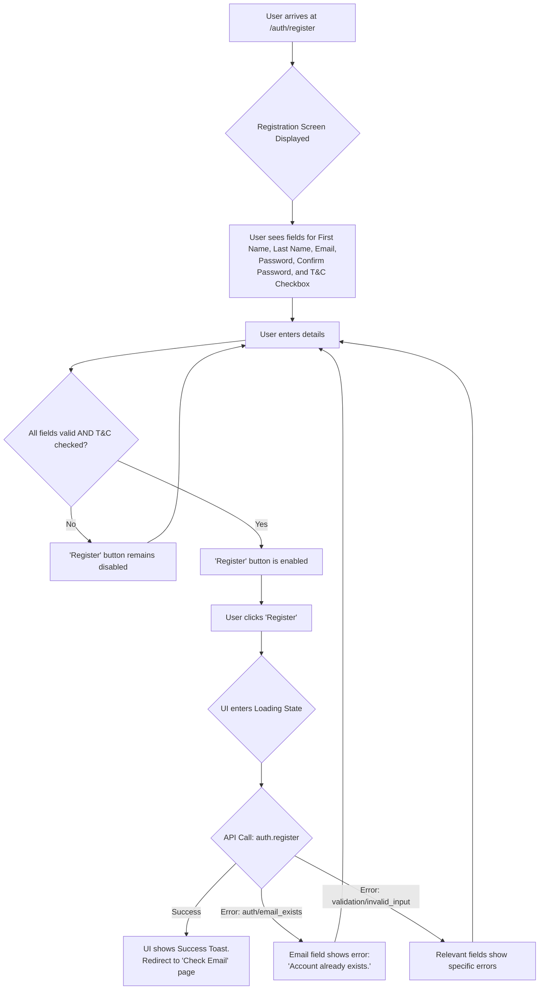
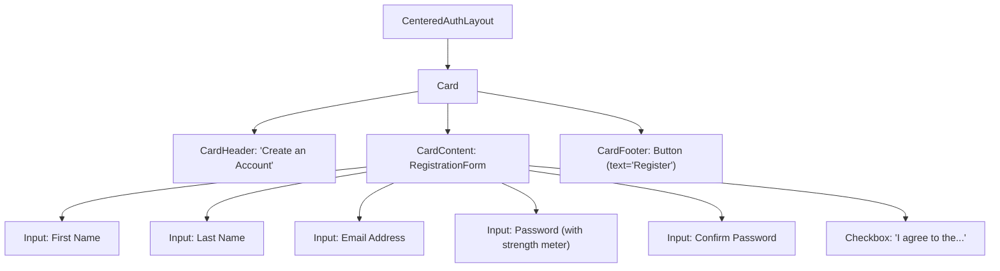
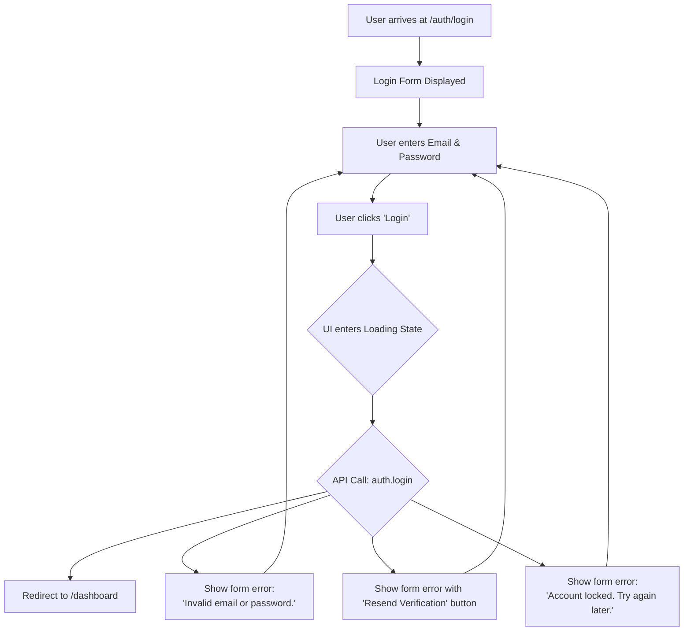
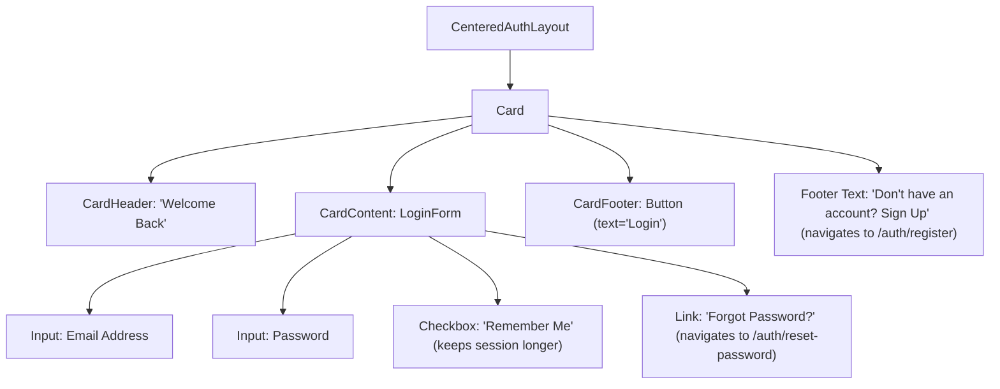
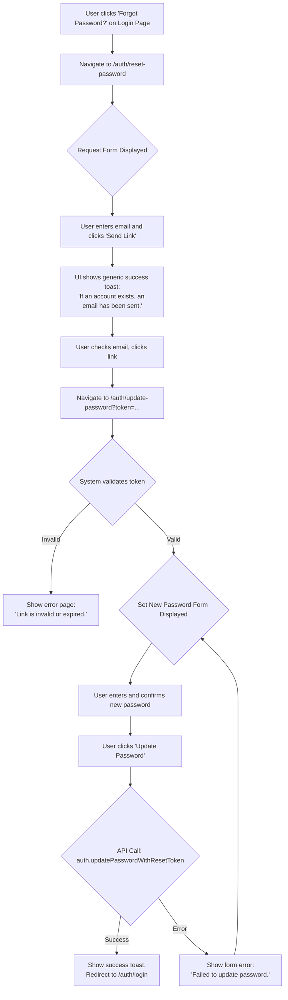

# PUMP: UI/UX Specification

**Version:** 2.0
**Status:** APPROVED
**Author:** Zuzka & Detritus, Design Architect

## 0. Introduction

This document provides the definitive UI/UX specification for the Pluggable User Management Platform (PUMP). It translates the `PRD.md` and `Architecture.md` into a concrete visual and interactive blueprint for the frontend application.

This specification is built upon the **"Foundation-First Hybrid"** strategy. It is organized into two main parts:

-   **Part 1: The Foundational Design System.** This section defines the core, reusable, and scalable visual language of the platform. The components and systems defined here are designed with the full H2-Enterprise scope in mind to prevent future refactoring.
-   **Part 2: H1-MVP User Journeys.** This section provides detailed, screen-by-screen specifications for the H1-MVP features, built using the foundational system from Part 1.

This document, in conjunction with its companion `ui_ux-notes.md`, serves as the primary source of truth for all frontend development.

---

## 1. Overall UX Goals & Core Design Principles

### 1.1. UX Goals
- **Developer Experience First:** As a pluggable module, our primary user is the integrating developer. The UI must be easy to theme, configure, and embed.
- **Trust & Security:** The interface must project rock-solid security and reliability, giving end-users confidence when entering sensitive credentials and payment information.
- **Frictionless Onboarding:** End-user flows for registration, login, and initial setup must be intuitive, fast, and require minimal cognitive load.
- **Clarity & Control:** For authenticated users managing their profile, security settings, or billing, the UI must provide clear information and unambiguous controls.

### 1.2. Core Design Principles
- **Clarity Above All:** Prioritize clear information hierarchy and unambiguous language. Never sacrifice clarity for aesthetic novelty.
- **Showcase-Quality Aesthetics:** The design must inspire confidence through a high level of visual polish and consistent feedback, reflecting the quality of a commercial-grade SaaS product.
- **Purposeful Design:** Every UI element must serve a distinct purpose. Avoid clutter while maintaining a professional aesthetic.
- **Scalable Foundation:** The underlying design system (components, tokens) must be robust enough to support future expansion into complex H2-Enterprise features without requiring a rewrite.

---

## 2. Information Architecture (IA)

### 2.1. H1-MVP Screen Inventory
- **Authentication Module:**
    - `Login Screen` (`/auth/login`)
    - `Registration Screen` (`/auth/register`)
    - `Password Reset Request Screen` (`/auth/reset-password`)
    - `Set New Password Screen` (`/auth/update-password?token=...`)
    - `Verify Email Screen` (`/auth/verify-email?token=...`)
    - `Check Your Email Prompt Screen`
- **Main Application (Dashboard Settings):**
    - `Profile Settings` (`/settings/profile`)
    - `Security Settings` (`/settings/security`)
    - `Billing & Subscription Settings` (`/settings/billing`)

### 2.2. Navigation Structure
The PUMP application utilizes a primary sidebar navigation system for its settings area, complemented by a user-specific menu.
- **Primary Sidebar Navigation (in `/settings`):**
    - `Profile`: Links to the `/settings/profile` screen.
    - `Security`: Links to the `/settings/security` screen.
    - `Billing`: Links to the `/settings/billing` screen.
- **User-Specific Navigation (Top Right Header):**
    - A user avatar/icon dropdown menu will contain:
        - A link to the main settings page (`/settings/profile`).
        - A `Logout` action.

---

## Part 3: The Foundational Design System

_Before diving into tokens and primitives, note that the component library is intentionally layered to support multiple integration depths:_

1. **Primitives (`src/ui/primitives`)** – token-driven atoms and molecules such as `Button`, `Input`, `Dialog`.
2. **Headless (`src/ui/headless`)** – logic-only hooks/components exposing render-prop or slot APIs with **no styling**.
3. **Styled (`src/ui/styled`)** – fully themed, production-ready compositions that import the same logic from `headless` plus visuals from `primitives`.

Integrators can cherry-pick the layer that matches their needs (e.g., wrap headless flows with their own design-system while still re-using PUMP business logic).

### 3.1. Theming & Pluggability Contract

This contract defines how a host application can customize the PUMP's appearance to match its own branding.

#### 3.1.1. Design Tokens

The following tokens represent the customizable elements of the UI.

| Category | Token Name | Default (Dark Mode) | Default (Light Mode) | Description |
| :--- | :--- | :--- | :--- | :--- |
| **Color** | `primary` | `#3B82F6` (Blue 500) | `#2563EB` (Blue 600) | Main brand color for interactive elements. |
| | `primaryForeground`| `#FFFFFF` (White) | `#FFFFFF` (White) | Text color on primary backgrounds. |
| | `background` | `#111827` (Gray 900) | `#FFFFFF` (White) | Main page background color. |
| | `foreground` | `#F9FAFB` (Gray 50) | `#111827` (Gray 900) | Default text color. |
| | `card` | `#1F2937` (Gray 800) | `#F9FAFB` (Gray 50) | Background for card-like containers. |
| | `border` | `#374151` (Gray 700) | `#D1D5DB` (Gray 300) | Default border and divider color. |
| | `input` | `#374151` (Gray 700) | `#FFFFFF` (White) | Default background for input fields. |
| | `destructive` | `#EF4444` (Red 500) | `#EF4444` (Red 500) | Color for destructive actions (e.g., delete). |
| | `success` | `#22C55E` (Green 500) | `#22C55E` (Green 500) | Color for success states and feedback. |
| **Typography** | `fontFamilySans` | `Inter, sans-serif` | `Inter, sans-serif` | Default sans-serif font stack. |
| **Border Radius** | `radiusSm` | `0.25rem` | `0.25rem` | Small border radius. |
| | `radiusMd` | `0.5rem` | `0.5rem` | Medium border radius (e.g., for cards). |
| | `radiusLg` | `0.75rem` | `0.75rem` | Large border radius (e.g., for modals). |
| **Spacing Scale** | `spaceXs` | `0.25rem` | `0.25rem` | Extra-small spacing |
| | `spaceSm` | `0.5rem` | `0.5rem` | Small spacing |
| | `spaceMd` | `1rem` | `1rem` | Medium spacing (default gutter) |
| | `spaceLg` | `1.5rem` | `1.5rem` | Large spacing |
| | `spaceXl` | `2rem` | `2rem` | Extra-large spacing |

#### 3.1.2. The `theme` Object Structure

A host application provides its theme by passing an object with the following structure. Any omitted values will fall back to the defaults listed above.

```typescript
interface Theme {
  colors?: {
    primary?: string;
    primaryForeground?: string;
    background?: string;
    // ... etc
  };
  typography?: {
    fontFamilySans?: string;
  };
  borderRadius?: {
    radiusSm?: string;
    radiusMd?: string;
    radiusLg?: string;
  };
}
```

#### 3.1.3. Runtime Color Mode API

A root `<ThemeProvider>` included with PUMP exposes an ergonomic hook to query and switch color modes at runtime.

```typescript
const { mode, setMode, toggle } = useColorMode();
/**
 * mode: 'dark' | 'light'
 * setMode(next: 'dark' | 'light') // explicitly select a mode
 * toggle() // convenience helper to flip modes
 */
```

Implementation notes:

- The provider toggles a `data-theme` attribute on the `html` element and swaps the CSS variable set (`--color-primary`, etc.).
- All design-tokens are surfaced as CSS variables, so components automatically update when the mode changes.
- Host applications may call `setMode` or `toggle` directly, or ignore the API entirely if they only ship a single color mode.

#### 3.1.4. Typography & Spacing System

In addition to tokenised colors, the design-system exposes a type ramp and spacing scale that ensures visual rhythm across light & dark modes.

| Token | Size | Line-height | Use-case |
| --- | --- | --- | --- |
| `textXs` | 0.75rem | 1rem | Helper text, captions |
| `textSm` | 0.875rem | 1.25rem | Secondary UI text |
| `textBase` | 1rem | 1.5rem | Body text |
| `textLg` | 1.125rem | 1.75rem | Section headings |
| `textXl` | 1.25rem | 1.75rem | Card titles |
| `text2xl` | 1.5rem | 2rem | Modal titles |
| `text3xl` | 1.875rem | 2.25rem | Page H1 |

Spacing tokens (`spaceXs`-`spaceXl`) are surfaced as CSS variables and mirror Tailwind's spacing scale for familiarity.

### 3.2. Layout & Grid System

#### 3.2.1. Responsive Breakpoints

The UI will use a standard set of responsive breakpoints.

-   `sm`: 640px
-   `md`: 768px
-   `lg`: 1024px
-   `xl`: 1280px

#### 3.2.2. Standard Page Layouts

1.  **`CenteredAuthLayout`**
    -   **Use Case:** Login, Register, Password Reset pages.
    -   **Structure:** A single, centered column on a plain background, typically containing a card or form with a maximum width (e.g., `450px`).

2.  **`DashboardSettingsLayout`**
    -   **Use Case:** User Profile, Account Settings, Team Management.
    -   **Structure:** A two-column layout. A primary navigation sidebar on the left and a main content area on the right. The main content area may itself be divided into sub-sections.
    -   **Responsive Behavior:** At the `md` breakpoint (768px) and below, the primary sidebar navigation collapses. A hamburger menu icon will appear in the application header to toggle its visibility as a slide-out panel.

### 3.3. Primitive Component API Specification

This section defines the complete API for our core UI primitives.

#### 3.3.1. `<Button />`

A clickable button element used for actions.

-   **Props:**
    -   `variant: 'default' | 'destructive' | 'outline' | 'ghost' | 'link'` (Default: `default`)
    -   `size: 'default' | 'sm' | 'lg' | 'icon'` (Default: `default`)
    -   `isLoading?: boolean` (If true, shows a spinner and disables the button).
    -   `asChild?: boolean` (Allows the button to wrap a child component, passing styles down).
    -   ...plus all standard HTMLButtonElement props.

#### 3.3.2. `<Input />`

A text input field.

-   **Props:**
    -   `type: string` (e.g., 'text', 'email', 'password').
    -   `label?: string` (A visible label for the input).
    -   `placeholder?: string`
    -   `value: string`
    -   `onChange: (value: string) => void`
    -   `error?: string` (If provided, displays an error message and applies error styling).
    -   `disabled?: boolean`
    -   `iconLeft?: React.ReactNode` (An icon to display on the left side of the input).
    -   ...plus all standard HTMLInputElement props.

#### 3.3.3. `<Card />`

A container for grouping related content. Composed of `<CardHeader>`, `<CardContent>`, and `<CardFooter>`.

-   **Props:**
    -   No special props beyond standard `div` props. Structure is determined by its children.

#### 3.3.4. `<Table />`

Displays tabular data.

-   **Props:**
    -   `data: T[]` (The array of data to display).
    -   `columns: ColumnDef<T>[]` (Column definitions, including headers and cell renderers).
    -   `isSortable?: boolean`
    -   `isFilterable?: boolean` (Enables a global filter input).
    -   `showPagination?: boolean`
    -   `onRowClick?: (row: T) => void`
-   **Type Definition for `ColumnDef<T>`:**
    ```typescript
    interface ColumnDef<T> {
      accessorKey: keyof T; // The key in the data object
      header: string; // The text to display in the header
      cell?: (row: T) => React.ReactNode; // Optional custom cell renderer
    }
    ```

#### 3.3.5. `<Toast />`

A dismissible notification message. Triggered programmatically.

-   **Programmatic API:** `toast({ variant, title, description, action })`
    -   `variant: 'default' | 'destructive' | 'success'`
    -   `title: string`
    -   `description?: string`
    -   `action?: { label: string; onClick: () => void; }`

#### 3.3.6. `<Skeleton />`

A placeholder component that mimics the shape of content while data loads.

- **Props:**
  - `width?: number | string` – accepts numbers (px) or CSS strings (e.g., `'50%'`).
  - `height?: number | string`
  - `radius?: string` – border-radius (defaults to `var(--radiusSm)`).
  - `animate?: boolean` (default `true`) – toggles shimmer animation.

- **Usage:**
  ```tsx
  <Skeleton width="100%" height={40} />
  ```

- **Implementation:** Utilises a keyframe shimmer, respects the current color-mode via `--skeleton-bg`/`--skeleton-fg` variables.

### 3.4. Motion & Animation Guidelines

| Motion Token | Duration | Easing | Typical Use |
| --- | --- | --- | --- |
| `motionFast` | 120 ms | `var(--easeOut)` | Hover / focus subtle fades |
| `motionNormal` | 200 ms | `var(--easeOut)` | Button presses, accordion open |
| `motionSlow` | 300 ms | `var(--easeInOut)` | List re-orders, page section reveals |
| `motionModal` | 150 ms | `cubic-bezier(0.16, 1, 0.3, 1)` | Dialog / sheet entrance |

_Easing variables_
```css
--easeOut: cubic-bezier(0.22, 1, 0.36, 1);
--easeInOut: cubic-bezier(0.4, 0, 0.2, 1);
```

Rules:
1. **Respect prefers-reduced-motion**: when true all transform/opacity animations fade to `motionFast` & opacity-only transitions.
2. Never animate colour alone; pair with opacity or transform for accessibility.
3. Avoid `motionSlow` on critical path interactions (e.g., form submit) to keep UX snappy.

### 3.5. Iconography Contract

• **Default set:** [Lucide](https://lucide.dev) SVG icons, unmodified.  
• **Sizes:** 16 px (inline), 20 px (buttons), 24 px (section headers).  
• **Component:** `<Icon name="plus" size={20} className="..." />` – thin wrapper that forwards props to underlying SVG.

_Override strategies_
1. **Token slot** – any primitive that embeds an icon accepts `icon?: React.ReactNode` so hosts can inject their own SVG.
2. **Global alias** – host may provide `<IconsProvider value={{ plus: MyPlusIcon }}>` to swap globally.

### 3.6. Empty-State Patterns

Component API:
```tsx
<EmptyState
  illustration={<Icon name="folder" size={48} />}
  title="No projects yet"
  description="Get started by creating a new project."
  action={<Button onClick={onCreate}>Create Project</Button>}
/>
```
• Illustration style: outlined monochrome icon (`foreground` colour at 20 % opacity).  
• Copy tone: concise, action-oriented, second-person.  
• Used in: tables with zero rows, 404-like dashboards, search no-results.

---

## Part 4: H1-MVP User Journeys

### 4.1. User Registration Flow (PRD 4.1.1)

#### 4.1.1. Screen Flow Diagram


#### 4.1.2. Screen Structure



#### 4.1.3. Interaction & States

1.  **Default State:** All fields are empty. "Register" button is disabled.
2.  **User Input:** As the user types in the password field, a password strength meter appears. The meter must provide real-time feedback on the following criteria, with each item getting a visual checkmark when met: 'At least 8 characters', 'Contains one uppercase letter', 'Contains one number', 'Contains one special character'.
3.  **Validation:** The "Register" button becomes enabled only after all fields are valid and the "Terms and Conditions" checkbox is checked.
4.  **Loading State:** On submit, the "Register" button becomes disabled and shows a loading spinner (`isLoading=true`). All form fields become read-only.
5.  **Success State:**
    -   A success toast appears: `toast({ variant: 'success', title: 'Registration Successful', description: 'Please check your email to verify your account.' })`.
    -   The user is redirected to a "Check your email" page.
6.  **Error States:**
    -   If API returns `auth/email_exists`, the Email field shows the error message: "An account with this email already exists. Please login."
    -   If API returns `validation/invalid_input`, the relevant fields show specific error messages (e.g., "Password must contain at least 8 characters").
    -   **Network Failure / Timeout:** If the API is unreachable, a toast appears: `toast({ variant: 'destructive', title: 'Network Error', description: 'Could not connect to the server. Please try again.' })`. The form is re-enabled.

### 4.2. User Login Flow (PRD 4.1.2)

#### 4.2.1. Screen Flow Diagram


#### 4.2.2. Screen Structure



#### 4.2.3. Interaction & States

1.  **Loading State:** On submit, the "Login" button shows a loading spinner.
2.  **"Remember Me":** When checked, the session cookie will be issued with an extended expiration (30&nbsp;days instead of 1&nbsp;day). When unchecked, the session ends when the browser is closed.
3.  **Session Expiry Handling:** If a user's session expires while they are active, the next protected action automatically redirects them to `/auth/login` with a flash message "Your session has expired. Please log in again." Any unsaved form data should be discarded.
4.  **Success State:** The user is redirected to the application dashboard (`/dashboard`).
5.  **Error States:**
    -   `auth/invalid_credentials`: A global error message appears above the form: "Invalid email address or password."
    -   `auth/unverified`: A global error message appears: "Your account is not verified. Check your email for a link." It includes a "Resend Verification" button.
    -   `auth/account_locked`: A global error message appears: "Account locked. Please try again in 15 minutes or reset your password."
    -   **Network Failure / Timeout:** A toast appears: `toast({ variant: 'destructive', title: 'Network Error', description: 'Could not connect to the server. Please try again.' })`. The form is re-enabled.

### 4.3. Password Reset Flow (PRD 4.1.5)

#### 4.3.1. Flow Diagram



#### 4.3.2. Interaction & States

-   **Request Page:** A single email input and a "Send Reset Link" button. On submit, it *always* shows a success message to prevent user enumeration.
-   **Set New Password Page:**
    -   Contains two password fields (`New Password`, `Confirm New Password`) with the password strength meter.
    -   If the token from the URL is invalid/expired, the page displays an error message: "This password reset link is invalid or has expired." and hides the form.
    -   On successful password update, it redirects the user to the Login page and shows a success toast: `toast({ variant: 'success', title: 'Password Updated', description: 'You can now log in with your new password.' })`.

### 4.4. Profile & Account Management Flows (PRD 4.1.7, 4.1.8, 4.1.9)

#### 4.4.1. Screen Structure

-   Uses the `DashboardSettingsLayout`.
-   The sidebar contains links to "Profile", "Security", "Billing".
-   The main content area is divided into cards for each section.

#### 4.4.2. "Profile" Section

-   A card displaying `First Name`, `Last Name`, and `Bio`.
-   An "Edit" button switches the card's content to input fields, pre-filled with the user's current data. The "Edit" button is replaced by "Save" and "Cancel" buttons.
-   An avatar component shows the user's picture with an "Upload" button on hover.

#### 4.4.3. "Privacy" Section – Profile Visibility

-   **Structure:** A card titled "Privacy" containing a radio group (or toggle) labeled "Profile Visibility" with options:
    - `Public` – Anyone with a link can view my profile.
    - `Private` – Only I can view my profile.
-   **Interaction & States:**
    1. Radio reflects current setting from the server.
    2. Switching option immediately calls `profile.updateVisibility` tRPC procedure; while pending, inputs are disabled.
    3. On success a success toast appears. On error the radio reverts and an error toast shows.

#### 4.4.4. "Security" Section - Change Password

-   **Structure:** A card containing the `Current Password`, `New Password`, and `Confirm New Password` fields, and a "Save Changes" button.
-   **Interaction & States:**
    1.  **Default:** Fields are empty. "Save Changes" is disabled.
    2.  **Loading:** On submit, button shows a spinner.
    3.  **Success:** A success toast is displayed. Fields are cleared.
    4.  **Error:** An error message is displayed within the card (e.g., "Current password is incorrect").

#### 4.4.5. "Security" Section - Change Email (PRD 4.1.9)

-   **Flow Diagram:**
    ```mermaid
    graph TD
        A[User navigates to /settings/security] --> B{UI shows current email and 'Change' button};
        B --> C[User clicks 'Change'];
        C --> D{Input for New Email and 'Send Verification' button appear};
        D --> E[User enters new email and clicks 'Send'];
        E --> F{UI enters Loading State};
        F --> G["API call: profile.requestEmailChange"];
        G -- Success --> H["UI updates to show: 'Verification link sent to [new email].<br/>Please click the link to confirm.'"];
        G -- Error --> I["Input shows error message, e.g., 'Email already in use'"];
        I --> D;
    ```
-   **Interaction & States:**
    -   The flow is security-critical. The user's primary email is NOT changed until the link sent to the *new* address is clicked.
    -   A notification must also be sent to the *old* email address upon successful completion of the change.

#### 4.4.6. "Security" Section - Account Deletion

-   **Structure:** A "Delete Account" button with `variant="destructive"`.
-   **Interaction & States:**
    -   Clicking it opens a `<Dialog />` (modal).
    -   The dialog requires the user to type "DELETE MY ACCOUNT" into an input field.
    -   The final "Confirm Deletion" button is disabled until the phrase is typed correctly.

### 4.5. Subscription & Billing Flow (PRD 4.2.1)

#### 4.5.1. Screen Structure

-   A "Billing" or "Subscription" page within the `DashboardSettingsLayout`.
-   The page displays a set of cards, one for each available plan (e.g., "Free", "Pro").
-   The user's current plan is highlighted with a "Current Plan" badge.

#### 4.5.2. Interaction & States

1.  For a plan the user is not on, the card displays a "Subscribe" or "Upgrade" button.
2.  Clicking this button triggers the `createCheckoutSession` tRPC call. The button enters a loading state.
3.  On success, the application redirects the user to the Stripe Checkout URL.
4.  For the user's current plan, the card displays a "Manage Billing" button.
5.  Clicking this button triggers the `createCustomerPortalSession` call and redirects the user to the Stripe Customer Portal.
6.  Upon returning from a successful checkout, the UI should reflect the new plan status.

---

## Part 5: Frontend Non-Functional Requirements

### 5.1. Accessibility (AX) Implementation Details
- **Target Compliance Level:** WCAG 2.1 Level AA.
- **Key Implementation Principles:**
    - **Semantic HTML:** Use HTML5 elements according to their meaning.
    - **Keyboard Navigation:** All interactive UI elements must be fully operable via keyboard. Focus order must be logical and focus indicators must be clearly visible.
    - **ARIA:** Use appropriate ARIA roles for custom components, but prefer semantic HTML.
    - **Color Contrast:** All text and UI elements must meet WCAG 2.1 AA contrast ratios (4.5:1 for normal text, 3:1 for large text).
    - **Forms:** All form inputs must have programmatically associated labels. Error feedback must be accessible.
- **Testing & Validation:** As part of the Definition of Done for any UI component, an automated accessibility scan (e.g., using Axe) must pass with no critical violations.

### 5.1.1. Focus & Outline Tokens

To guarantee consistent keyboard-navigation visuals, two new color tokens are introduced:

| Token | Dark | Light | Purpose |
| --- | --- | --- | --- |
| `focusRing` | `#2563EB80` | `#2563EB80` | Translucent outline for focusable components |
| `focusRingInner` | `#2563EB` | `#2563EB` | Solid inner outline for contrast |

Components apply a `box-shadow` stack that references these tokens:
```css
box-shadow: 0 0 0 2px var(--color-focusRingInner), 0 0 0 4px var(--color-focusRing);
```

### 5.2. Performance Considerations
- **Image Optimization:** Use modern formats (e.g., WebP) and the Next.js `<Image>` component for automatic optimization.
- **Code Splitting:** Rely on Next.js route-based code splitting. Use dynamic imports for large components that are not needed on initial load.
- **Virtualization:** For any UI that renders long lists of data (e.g., H2-Enterprise audit logs or user tables), virtualization **MUST** be used to ensure high performance.
- **State Management:** Keep component state as local as possible. Use global state (Zustand) only for truly global data (e.g., user session).

### 5.3. Frontend Security Considerations
This checklist applies to all frontend code and should be confirmed during code review for any component handling user input.
- **XSS Prevention:** Rely on React's built-in JSX auto-escaping. Never use `dangerouslySetInnerHTML` without sanitizing the content with a library like DOMPurify.
- **Secure Token Handling:** Do not store sensitive tokens in `localStorage`. The `client-sdk` will manage tokens in memory.
- **Dependency Vulnerabilities:** Regularly scan dependencies using `pnpm audit`. High-severity vulnerabilities must be addressed before merging to `main`.
- **API Key Exposure:** No sensitive API keys should be present in the client-side code. All such keys must be used only on the backend.


### 5.5. Internationalisation & RTL Strategy

1. **Translation workflow** – message keys live in `locales/<lang>/<namespace>.json`.  Use `t('auth.login.title')` via a lightweight i18n hook.  Pull requests must include English copy plus placeholders for other locales.
2. **Pluralisation** – ICU message syntax via `@formatjs/intl`.
3. **RTL support** – when `dir="rtl"` is set on `<html>` primitives switch logical CSS (`margin-inline-start` etc.). ThemeProvider listens to `langDir` context.

### 5.6. Error-Boundary & Fatal-Error UX

`<AppErrorBoundary>` wraps the app root; on crash it renders:
```tsx
<FullPageError
  title="Something went wrong"
  description="An unexpected error occurred. Please refresh or contact support."
  action={<Button onClick={refresh}>Refresh</Button>}
/>
```
• Uses same EmptyState component with variant="destructive".

### 5.7. Analytics & Telemetry Hooks

Provide a tiny abstraction `track(event: string, meta?: Record<string, any>)`.  Default implementation is a no-op; host apps inject Segment/GA/NewRelic providers.  Listeners fire on:
• Route change (page-view)  
• Key UI events (CTA clicks, form success)  
Opt-out: set `analyticsEnabled:false` in config context.

### 5.8. High-Contrast & System Forced-Colors (Roadmap)

Phase 3 will add a `contrast` mode triggered by `@media (prefers-contrast: more)` mapping tokens to WCAG AAA compliant colours.  Token names will mirror existing palette with `-hc` suffix (`primaryHc`, `backgroundHc`, ...).

---

## Part 6: Future-Phase Blueprint (Phases 3-8)

### 6.1. Scope & Philosophy
This section acts as a "north-star map" for capabilities described in Phase 3-8 docs. It ensures:
1. the design-system already contains (or has placeholders for) any **new** primitives needed later, and  
2. IA & layouts can absorb upcoming screens without refactor.

### 6.2. Additional Screen Inventory (Beyond H1-MVP)
• Business registration wizard (`/auth/register?type=business`)  
• Company / Business profile settings (`/settings/company`)  
• Domain verification flow (`/settings/company/domain-verification`)  
• Team management console (`/settings/team`)  
• Admin dashboard overview (`/admin/dashboard`)  
• Advanced auth flows (SSO callback, MFA wizard, backup codes)  
• Billing & licensing additions (checkout success, seat-usage, invoices)  
• Notification preferences (`/settings/notifications`)  
• Organization security-policy editor (`/settings/security/policy`)  
• Session management list (`/settings/security/sessions`)  
• Data-export request pages  
• Responsive / mobile breakpoint validations

### 6.3. Design-System Extensions Needed
| Primitive | Planned Props / Notes | Consuming Feature |
|-----------|-----------------------|-------------------|
| `<Select />` | searchable, async options | business registration, role picker |
| `<RadioGroup />` | accessible group with legend | privacy, policy forms |
| `<Badge />` | status indicators | plan "Current", "Pending" |
| `<ProgressBar />` | simple % bar | seat-usage, password strength |
| `<Stepper />` | step indicator | wizards |
| `<Dialog />` | ensure scroll & destructive variant | account delete confirm |
| `<AvatarUpload />` | square variant, cropper | company logo |

These must be added to Part 3 before Phase 3 work begins.

### 6.4. IA / Navigation Evolution
Settings sidebar grows: Profile | Security | Billing | Company | Team | Notifications.  
Admin-only top-level "Admin" link exposes console routes.  
New wizards reuse `CenteredAuthLayout`.

### 6.5. Open Decisions & TODOs
1. Motion spec fine-tuning for wizards (slide vs fade).  
2. Exact copy for business-registration success states.  
3. Invoice history location (native vs Stripe portal).  
4. Security-level badge visual language.  
5. Dark-mode audit for new primitives.

---

## Appendix A – Foundational Design Checklist (Must be GREEN before shipping)

| Area | Status | Notes |
|---|---|---|
| Dual color palettes | ✅ | Dark & Light token sets defined |
| Responsive grid & breakpoints | ✅ | Section 3.2 |
| Accessibility baseline (WCAG AA) | ✅ | Section 5.1 |
| Component APIs documented | ✅ | Section 3.3 |
| Typography scale & spacing tokens | ✅ | Section 3.1.4 |
| Skeleton/loading pattern | ✅ | Section 3.3.6 |
| Focus/outline styling tokens | ✅ | Section 5.1.1 |
| Motion guidelines | ✅ | Section 3.4 |
| Iconography guidelines | ✅ | Section 3.5 |
| Empty-state patterns | ✅ | Section 3.6 |
| i18n & RTL strategy | ✅ | Section 5.5 |
| High-contrast theme | ⚠ | Roadmap defined in 5.8 |
| Error boundary UX | ✅ | Section 5.6 |
| Analytics/telemetry hooks | ✅ | Section 5.7 |
| State-management guidelines | ✅ | Section 3.7 |

Legend: ✅ Covered ⚠ Planned / future phase

END OF SPEC 