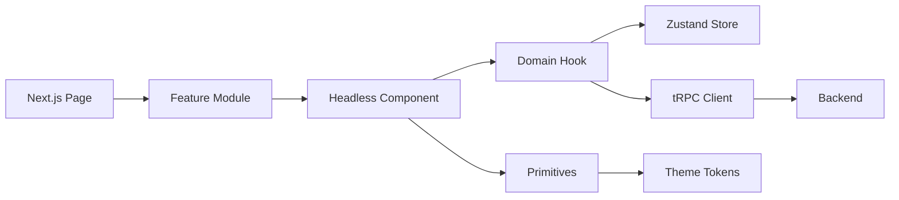
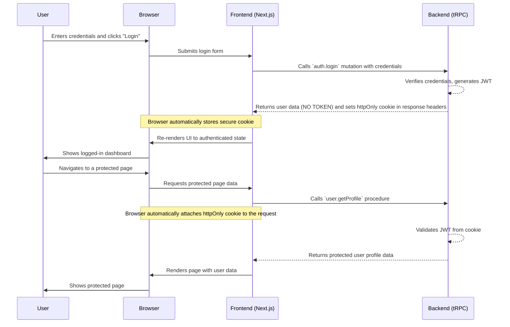

# Frontend Architecture Document

**Version:** 0.2 — Baseline Draft
**Status:** IN-PROGRESS
**Author:** Detritus, Design Architect

## Table of Contents
- [1. Introduction](#1-introduction)
- [2. Overall Frontend Philosophy & Patterns](#2-overall-frontend-philosophy--patterns)
- [3. Detailed Frontend Directory Structure](#3-detailed-frontend-directory-structure)
- [4. Component Breakdown & Implementation Details](#4-component-breakdown--implementation-details)
- [5. State Management In-Depth](#5-state-management-in-depth)
- [6. API Interaction Layer](#6-api-interaction-layer)
- [7. Routing Strategy](#7-routing-strategy)
- [8. Build, Bundling, and Deployment](#8-build-bundling-and-deployment)
- [9. Frontend Testing Strategy](#9-frontend-testing-strategy)
- [10. Accessibility (AX) Implementation Details](#10-accessibility-ax-implementation-details)
- [11. Performance Considerations](#11-performance-considerations)
- [12. Frontend Security Considerations](#12-frontend-security-considerations)
- [13. Browser Support & Progressive Enhancement](#13-browser-support--progressive-enhancement)
- [14. Monitoring & Observability](#14-monitoring--observability)
- [15. Feature Flag Strategy](#15-feature-flag-strategy)
- [16. Change Log](#16-change-log)


## 1. Introduction
This document defines the **frontend technical architecture** of the Pluggable User Management Platform (PUMP).
It complements:

• **Main Architecture Document:** [03-Architecture.md](./03-Architecture.md) — system-wide patterns, tech-stack selections, C4 diagrams.  
• **UI/UX Specification:** [04-UI-UX-Specification.md](./04-UI-UX-Specification.md) — visual language, component APIs, user journeys.  
• **Design files:** linked from the UI/UX specification (Figma source).

**Scope:** This document covers the H1-MVP phase only; later phases (H1-Core, H2) will be documented in future revisions.

Any frontend-specific elaborations or justified deviations from the main architecture are captured here.  The goal is to provide a clear, actionable blueprint for frontend development that ensures:

1. **Consistency** with system-level principles (pluggable service pattern, monorepo layout, type-safe tRPC boundary).  
2. **Seamless translation** of the approved UI/UX specification into maintainable code.  
3. **First-class developer experience (DX)** with robust testing, performance, accessibility, and security baked in.

## 2. Overall Frontend Philosophy & Patterns

### Framework & Core Libraries
* **React 18 + Next.js 14 (App Router)** — the canonical runtime; gives us SSR/SSG/ISR out-of-the-box and route-level code-splitting.
* **TypeScript 5.x** — strict mode on; end-to-end types with tRPC.
* **tRPC** — single RPC boundary between frontend and co-located backend; no REST generators needed.
* **React Hook Form + Zod** — form state & validation.
* **Shadcn UI** — baseline primitive component library mandated by the PRD (§7).
* **Storybook** — isolated component development and visual regression testing.
* **pump-i18n (i18n & RTL)** — shared hooks & provider located in `/packages/pump-i18n`; aligns with UI/UX §5.5.

### Component Architecture
Layered, opt-in depth (mirrors UI/UX spec §3):
1. **Primitives** — token-driven atoms & molecules (`packages/pump-primitives`).
2. **Headless** — logic-only flows, no styling (`pump-headless`).
3. **Styled** — full visuals, wraps primitives + headless (`pump-styled`).

Pages compose **Feature Modules**, which in turn compose headless components & domain hooks.  Components are presentational; business rules live in hooks/services.

### State-Management Strategy
* Default to **local/component state** (`useState`, `useReducer`).
* **React Context** for narrow cross-tree concerns (theme, form wizard context).
* **Zustand domain stores** for truly global client data (e.g., UI state like notifications, or cached, non-sensitive feature data). The session store specifically **MUST NOT** hold authentication tokens; it should only manage user session *status*. Stores live in `packages/pump-state` and are accessed exclusively via typed hooks (`useAuthStore`, `useBillingStore`). SSR-safe hydration pattern (stores created per request on server, merged on client).

### Data Flow
Unidirectional: UI → Domain Hook → Service( tRPC client ) → Backend.  React Query can be layered on per-hook basis for caching and optimistic updates.

### Styling Approach
* **Tailwind CSS 3** driven by CSS variables exported from the design-token build.
* Theme toggled by `<ThemeProvider>` which sets `data-theme` attr; primitives read CSS vars, no conditional class thrash.
* Any ad-hoc styles live in component co-located `*.module.css` or Tailwind utilities; avoid global CSS.

### Key Design Patterns
* **Provider pattern** for cross-cutting concerns (Theme, Auth, Analytics).
* **Hook-First API** — domain hooks abstract stores/services and expose typed selectors/actions.
* **Adapter pattern** remains server-side; FE relies on interface contracts via tRPC types.
* **Error Boundary** at App root plus feature-level boundaries.
* **Suspense + Skeleton** for async UI with graceful loading states.
* **File-per-unit** & **barrel exports** for discoverability.

### 2.1. Layered Architecture Diagram & Contracts

The following diagram illustrates the flow of data and control through the frontend layers. The contracts below it are mandatory rules for how these layers must interact.



**Architectural Contracts:**

1.  **Pages** orchestrate Feature Modules and are responsible for route-level concerns like data loading for the page and route guards.
2.  **Feature Modules** compose Headless Components and Domain Hooks to build a piece of business functionality.
3.  **Headless Components** are purely presentational. They **MUST NEVER** import API logic or stores directly; they receive all data and callbacks as props.
4.  **Domain Hooks** encapsulate all business logic, data-fetching, and state interaction for a feature. They are the only layer allowed to call services (like the tRPC client) or interact with Zustand stores.
5.  **Zustand Stores** are the single source of truth for all global client-side state for their respective domains.

## 3. Detailed Frontend Directory Structure

### 3.1. High-Level Monorepo Structure

The project is organized as a `pnpm` workspaces monorepo to facilitate code sharing and independent versioning of core libraries. It uses **Changesets** to manage versioning and publishing.

```text
/apps
  /user-mgmt           — The main Next.js frontend & backend application.
  /example-host        — A separate Next.js host app for integration testing.
/tests                 — End-to-End Playwright specs live in `/tests/e2e`.
/packages
  /pump-primitives     — Core, unstyled UI components (Atoms/Molecules).
  /pump-headless       — Logic-only hooks and state handlers for complex UI flows.
  /pump-styled         — Themed, production-ready components that combine primitives and headless logic.
  /pump-hooks          — Reusable, domain-specific hooks (e.g., useAuth, useSubscription).
  /pump-state          — Global Zustand stores for different domains (session, ui, etc.).
  /pump-theme          — Design tokens, CSS variables, and the ThemeProvider.
  /pump-icons          — Icon library wrappers and management (e.g., Lucide).
  /pump-testing        — Shared test utilities, mocks, and fixtures.
  /pump-config         — Shared configurations (tsconfig, ESLint, Prettier, etc.).
```

### 3.2. Application-Internal Directory Structure (`apps/user-mgmt/src/`)

This structure details the internal layout of the main Next.js application, promoting scalability and a clear separation of concerns.

```plaintext
src/
├── app/                        # Next.js App Router: MUST contain route segments, layouts, and page components.
│   ├── (auth)/                 # Route group for authentication pages.
│   │   ├── login/page.tsx
│   │   └── register/page.tsx
│   ├── (dashboard)/            # Route group for protected dashboard pages.
│   │   ├── layout.tsx          # Shared layout for dashboard (e.g., with sidebar).
│   │   └── settings/
│   │       └── profile/page.tsx
│   ├── api/                    # Backend tRPC handlers, co-located with the app.
│   │   └── trpc/[trpc]/route.ts
│   ├── globals.css             # Global styles, Tailwind directives, and CSS variable definitions.
│   └── layout.tsx              # Root application layout.
├── components/                 # Globally shared, reusable, presentational UI components.
│   ├── ui/                     #   - Primitives from Shadcn UI (Button, Input, Card). MUST NOT contain business logic.
│   └── layout/                 #   - Layout components (Header, Sidebar, PageWrapper).
├── features/                   # Business domain logic and components.
│   └── user-profile/
│       ├── components/         #   - Components used only by the user-profile feature.
│       └── hooks/              #   - Feature-specific hooks (e.g., useProfileForm).
├── hooks/                      # Global, reusable React Hooks (e.g., useAuth, useTheme).
├── lib/                        # Utility functions, helpers, constants. MUST contain pure functions.
├── client-services/            # Frontend API helpers and tRPC client definitions (avoids confusion with backend Service layer).
│   └── trpc.ts                 #   - tRPC client setup and typed procedure hooks.
└── store/                      # Global state management (Zustand).
    ├── session.store.ts        #   - Store for user session status (e.g., isAuthenticated, user roles). MUST NOT store JWTs.
    └── ui.store.ts             #   - Store for UI state (modals, notifications).
```

### Notes on Structure:

*   **Relationship:** The `apps/user-mgmt` application imports and consumes the various libraries from the `/packages/*` directories. For example, a component in `features/user-profile/components` would import a button from `pump-primitives`.
*   **Feature-Sliced Design:** The `features/` directory is key. It allows us to group all files related to a specific domain together, making them self-contained and easier to maintain.
*   **Clear Boundaries:** There's a strict data flow: `app/` pages compose `features/` and `components/`. `features/` use `hooks/`, `client-services/`, and `store/` to manage logic and state. Components should not call services directly.

## 4. Component Breakdown & Implementation Details

This section outlines the conventions for defining UI components. Detailed specifications for most feature-specific components will emerge as user stories are implemented, but they **MUST** all follow the template defined below. This ensures consistency and clarity for developers and AI agents.

### 4.1. Component Naming & Organization

*   **Naming Convention:** Component files and their corresponding named exports **MUST** use `PascalCase` (e.g., `ConfirmDialog.tsx`).
*   **Organization:** As defined in the directory structure, globally reusable primitives live in `/packages/pump-primitives`, shared layout components live in `apps/user-mgmt/src/components/layout/`, and feature-specific components are co-located within their feature directory (e.g., `apps/user-mgmt/src/features/auth/components/`).

### 4.2. Template for Component Specification

*This template MUST be used for defining any new, significant component.*

---
#### **Component:** `{ComponentName}`

*   **Purpose:** {A clear, one-sentence description of the component's role.}
*   **Source File(s):** {The exact path(s) to the component's source file(s), e.g., `/packages/pump-primitives/src/Button.tsx`.}
*   **Visual Reference:** {Link to the specific Figma frame or component from the UI/UX spec.}
*   **Props:**
    | Prop Name | Type | Required? | Default | Description |
    | :--- | :--- | :--- | :--- | :--- |
    | `{propName}` | `{type}` | `{Yes/No}` | `{default}` | {Description of purpose and constraints.} |
*   **Internal State:**
    | State Variable | Type | Initial Value | Description |
    | :--- | :--- | :--- | :--- |
    | `{stateName}` | `{type}` | `{initial}` | {Description of its purpose.} |
*   **Key UI Elements / Structure:**
    ```html
    <!-- A pseudo-HTML/JSX structure showing the core DOM elements and conditional logic. -->
    ```
*   **Actions Triggered (Side Effects):**
    *   **State Management:** {e.g., "Dispatches `sessionSlice.actions.setStatus('loading')`."}
    *   **API Calls:** {e.g., "Calls `authService.login()` from `src/services/authService.ts`."}
*   **Styling Notes:** {MUST reference specific Tailwind CSS utilities, CSS module classes, or Design System tokens used.}
*   **Accessibility Notes:** {MUST list key ARIA attributes, keyboard navigation behavior, and focus management requirements. **Checklist:** keyboard operability, correct `aria-*` usage, logical focus order.}
*   **Required Tests:** {Unit tests with Vitest + RTL, plus Axe snapshot for accessibility compliance.}

---

### 4.3. Example Foundational Component: `Button`

*   **Purpose:** Renders a clickable button element for all user-initiated actions.
*   **Source File(s):** `/packages/pump-primitives/src/Button.tsx`
*   **Visual Reference:** UI/UX Specification §3.3.1.
*   **Props:**
    | Prop Name | Type | Required? | Default | Description |
    | :--- | :--- | :--- | :--- | :--- |
    | `variant` | `'default' \| 'destructive' \| 'outline' \| 'ghost' \| 'link'` | No | `'default'` | The visual style of the button. |
    | `size` | `'default' \| 'sm' \| 'lg' \| 'icon'` | No | `'default'` | The size of the button. |
    | `isLoading`| `boolean` | No | `false` | If true, disables the button and shows a loading spinner. |
    | `asChild` | `boolean` | No | `false` | Allows the button to wrap a child, passing styles down. |
*   **Internal State:** None. This is a purely presentational component.
*   **Key UI Elements / Structure:**
    ```html
    <button class="{computedClasses}" disabled={isLoading || disabled}>
      {isLoading && <Spinner class="animate-spin" />}
      <span>{children}</span>
    </button>
    ```
*   **Actions Triggered (Side Effects):** None directly. It forwards standard DOM events like `onClick`.
*   **Styling Notes:** Uses Tailwind CSS with `cva` (class-variance-authority) to compute classes based on `variant` and `size` props. Styles are derived from theme tokens.
*   **Accessibility Notes:**
    *   It is a native `<button>` element, ensuring it's focusable and keyboard-operable by default.
    *   When `isLoading` is true, it is `disabled` to prevent interaction.
    *   If used as an icon button (`size='icon'`), it MUST have an `aria-label` for screen readers.

---

## 5. State Management In-Depth

This section expands on the state management strategy defined in the "Philosophy & Patterns" section, providing concrete examples and mandatory conventions.

### 5.1. Chosen Solution & Rationale

*   **Primary Solution:** **Zustand**.
*   **Rationale:** It provides a simple, unopinionated, and hook-based API that avoids the boilerplate of Redux. Its performance is excellent, and it's easy to create multiple, domain-specific stores, which aligns perfectly with our feature-sliced architecture.

### 5.2. Decision Guide for State Location

To ensure state is managed at the appropriate level, developers **MUST** follow this decision guide:

1.  **Is the state specific to a single component and not needed by its parent or children?**
    *   **Action:** Use `useState` or `useReducer` inside that component.

2.  **Is the state related to a specific UI flow (e.g., a multi-step form) and needs to be shared across a few components within that flow?**
    *   **Action:** Use React Context, scoped to the root of that UI flow.

3.  **Is the state truly global (e.g., user session status, UI theme, cached public data) and needs to be accessed by many unrelated components?**
    *   **Action:** Use a domain-specific Zustand store (e.g., `session.store.ts`).

### 5.3. Session & Authentication State

This subsection details the **mandatory** approach for handling authentication state on the client, aligning with the secure `httpOnly` cookie strategy.

*   **No Tokens in State:** The JWT **MUST NOT** be stored in Zustand, React Context, `localStorage`, or any other client-side storage mechanism accessible via JavaScript. The token lives exclusively in a secure, `httpOnly` cookie set by the server.

*   **Session Store's Role:** The `session.store.ts` is responsible for storing the *status* of the user's session, not the session identifier itself.
    *   **State Shape Example:**
        ```typescript
        interface SessionState {
          status: 'authenticated' | 'unauthenticated' | 'pending';
          user: {
            id: string;
            role: 'admin' | 'user';
            // Other non-sensitive user details
          } | null;
        }
        ```
    *   **Logic:** The store's primary role is to reflect whether a valid session exists. This is typically determined on app load by making an initial API call (e.g., `/api/trpc/auth.me`) that succeeds or fails based on the presence of the `httpOnly` cookie.

*   **Updating Session State:**
    *   **On Login:** After a successful login API call, the server sets the cookie. The client-side logic then calls an action in the session store (e.g., `setSession`) with the user payload returned from the API to update the state to `authenticated`.
    *   **On Logout:** The client calls a logout endpoint. The server clears the cookie. The client then calls a `clearSession` action to reset the state to `unauthenticated`.

### 5.4. Domain Store Implementation Example

To provide a clear, reusable pattern, all domain-specific hooks that combine a Zustand store with server-state from tRPC **SHOULD** follow this structure. This example demonstrates a hook for managing user profile data.

1.  **The Store (`/packages/pump-state/profile.store.ts`):** The store holds the client-side state and actions that can optimistically update it.

    ```typescript
    import { create } from 'zustand';
    import { trpc } from '@/client-services/trpc'; // tRPC client

    interface ProfileState {
      profile?: UserProfile; // Assuming UserProfile type is defined elsewhere
      updateProfile: (data: Partial<UserProfile>) => Promise<void>;
    }

    export const useProfileStore = create<ProfileState>((set, get) => ({
      profile: undefined,
      async updateProfile(patch) {
        // Optimistically update the local state
        const originalProfile = get().profile;
        set(state => ({ profile: { ...state.profile, ...patch } }));
        try {
          // Make the actual API call
          await trpc.profile.update.mutate(patch);
        } catch (error) {
          // If it fails, revert to the original state
          set({ profile: originalProfile });
        }
      },
    }));
    ```

2.  **The Domain Hook (`/packages/pump-hooks/useProfile.ts`):** This hook is the public-facing API for the feature. It fetches server data via React Query (`useQuery`) and syncs it with the Zustand store, while also exposing the store's actions.

    ```typescript
    import { useProfileStore } from './profile.store';
    import { trpc } from '@/client-services/trpc';

    export function useProfile() {
      const store = useProfileStore();
      const { data, status } = trpc.profile.get.useQuery(undefined, {
        onSuccess: (profile) => {
          // On successful fetch, hydrate the store with fresh data.
          store.setState({ profile });
        },
        staleTime: 60 * 1000, // Cache for 1 minute
      });

      // Return the combined state and actions
      return { ...store, isLoading: status === 'loading' };
    }
    ```

---

## 6. API Interaction Layer

This section defines how the frontend communicates with the backend, with a focus on the authentication flow and data fetching patterns.

### 6.1. Authentication Flow (Cookie-Based)

The authentication flow is designed to be secure and robust, relying on `httpOnly` cookies for session management.



**Key Principles:**

1.  **Server-Side Control:** The server is solely responsible for creating, managing, and expiring the session cookie.
2.  **No Client-Side Tokens:** The frontend JavaScript environment never has access to the authentication token. This mitigates XSS attacks aimed at stealing tokens.
3.  **Automatic Attachment:** The browser automatically includes the cookie on all subsequent requests to the same domain, simplifying API calls from the frontend.
4.  **State Synchronization:** The client-side `session.store.ts` is synchronized by making an initial API call on page load to check for a valid session, and by updating its state after login/logout operations.

### 6.2. API Key Exposure

*   **Asset Minification:** JavaScript and CSS minification is handled automatically by the Next.js production build process.
*   **Versioning:** Package versioning and changelog generation **MUST** be managed via **Changesets**.

## 7. Routing Strategy

This section details how navigation is handled in the Next.js application.

### 7.1. Route Definitions

The application uses the Next.js App Router. Main routes are defined by the directory structure in `apps/user-mgmt/src/app/`.

| Path Pattern             | Directory (`src/app/...`)       | Protection                                | Notes                                                               |
| :----------------------- | :------------------------------ | :---------------------------------------- | :------------------------------------------------------------------ |
| `/login`                 | `(auth)/login/page.tsx`         | `Public` (redirect if authenticated)      | Redirects to `/dashboard` if a valid session exists.                |
| `/register`              | `(auth)/register/page.tsx`      | `Public` (redirect if authenticated)      | Redirects to `/dashboard` if a valid session exists.                |
| `/settings/profile`      | `(dashboard)/settings/profile/page.tsx` | `Authenticated`                           | Renders user profile settings.                                      |
| `/settings/security`     | `(dashboard)/settings/security/page.tsx`| `Authenticated`                           | Renders password change, MFA, etc.                                  |
| `/settings/billing`      | `(dashboard)/settings/billing/page.tsx` | `Authenticated`                           | Renders subscription status and billing portal link.              |

### 7.2. Route Guards / Protection

*   **Authentication Guard:** Route protection will be implemented in the shared layout for protected route groups (e.g., `apps/user-mgmt/src/app/(dashboard)/layout.tsx`). This layout will use the `useSessionStore` hook to check the user's authentication status. If the user is not authenticated, it will programmatically redirect them to `/login` using the `redirect` function from `next/navigation`.
*   Because this check runs within a **Server Component**, the `redirect()` executes during the RSC render phase, preventing any client-side flash or double render.

## 8. Build, Bundling, and Deployment

This section details the frontend build and deployment process, complementing the main architecture document.

### 8.1. Build Process & Scripts

*   **Build Scripts (`package.json`):** The project relies on standard `pnpm` scripts managed at the monorepo root. The key scripts for the `user-mgmt` app are:
    *   `"dev"`: Runs the Next.js application in development mode.
    *   `"build"`: Creates a production-optimized build of the application.
    *   `"start"`: Runs the production server.
*   **Environment Configuration:** All environment-specific variables (e.g., `NEXT_PUBLIC_...`) **MUST** be managed via `.env` files (`.env`, `.env.local`, `.env.production`) as per Next.js conventions. Secrets must never be committed to source control.

### 8.2. Key Bundling Optimizations

*   **Code Splitting:** The Next.js App Router provides automatic route-based code splitting. No manual configuration is required for this.
*   **Lazy Loading:** For large, non-critical components or libraries, developers **MUST** use dynamic imports (`next/dynamic`) to lazy-load them.
*   **Asset Minification:** JavaScript and CSS minification is handled automatically by the Next.js production build process.
*   **Versioning:** Package versioning and changelog generation **MUST** be managed via **Changesets**.

### 8.3. Deployment to CDN/Hosting

*   **Target Platform:** The application is designed to be deployed to a modern Node.js hosting platform like Vercel or Railway, as specified in `03-Architecture.md`.
*   **Asset Caching:** The Next.js framework handles caching headers for immutable assets automatically. The default caching strategy is sufficient for the MVP.
*   **Focus:** Ensure components within a feature are correctly wired together and interact with mocked services as expected.
*   **Contract Testing (API Integration):**
    *   **Scope:** Verifying that the frontend's API client (tRPC) is compatible with the backend API.
    *   **Tools:** Mock Service Worker (MSW).
    *   **Focus:** Intercept outgoing tRPC requests and validate that they match the expected shape defined by the backend procedures. This prevents frontend-backend contract drift.
*   **End-to-End (E2E) UI Testing:**
    *   **Tool:** Playwright.
    *   **Scope:** Critical user journeys as defined in `04-UI-UX-Specification.md`, such as the full registration-login flow and the subscription checkout process.
*   **Visual Regression Testing:**
    *   **Tool:** Storybook with Chromatic.
    *   **Scope:** All primitives and styled components in the design system.
    *   **Focus:** On every pull request, Chromatic will take DOM snapshots of all Storybook stories and compare them against the baseline to catch unintended visual changes.
*   **Coverage Gate:** CI **MUST** enforce ≥ **80 %** statement and branch coverage for shared services and hooks via Vitest coverage reports.
*   **Accessibility Gate:** Axe a11y scans (jest-axe or Playwright Axe) must pass for all new components.

## 9. Frontend Testing Strategy

This section elaborates on the testing strategy from the main architecture document.

*   **Component Testing:**
    *   **Scope:** Individual UI components in `src/components/` and `src/features/*/components/`.
    *   **Tools:** Vitest and React Testing Library.
    *   **Focus:** Test rendering with different props, user interactions, and accessibility (`jest-axe`). All external dependencies and hooks will be mocked.
*   **Feature/Flow Testing (UI Integration):**
    *   **Scope:** Testing complete user flows within a feature (e.g., the entire login form submission).
    *   **Tools:** Vitest and React Testing Library, with mock providers for state (Zustand) and API (tRPC).
    *   **Focus:** Ensure components within a feature are correctly wired together and interact with mocked services as expected.
*   **Contract Testing (API Integration):**
    *   **Scope:** Verifying that the frontend's API client (tRPC) is compatible with the backend API.
    *   **Tools:** Mock Service Worker (MSW).
    *   **Focus:** Intercept outgoing tRPC requests and validate that they match the expected shape defined by the backend procedures. This prevents frontend-backend contract drift.
*   **End-to-End (E2E) UI Testing:**
    *   **Tool:** Playwright.
    *   **Scope:** Critical user journeys as defined in `04-UI-UX-Specification.md`, such as the full registration-login flow and the subscription checkout process.
*   **Visual Regression Testing:**
    *   **Tool:** Storybook with Chromatic.
    *   **Scope:** All primitives and styled components in the design system.
    *   **Focus:** On every pull request, Chromatic will take DOM snapshots of all Storybook stories and compare them against the baseline to catch unintended visual changes.
*   **Coverage Gate:** CI **MUST** enforce ≥ **80 %** statement and branch coverage for shared services and hooks via Vitest coverage reports.
*   **Accessibility Gate:** Axe a11y scans (jest-axe or Playwright Axe) must pass for all new components.

## 10. Accessibility (AX) Implementation Details

*   **Target Compliance:** WCAG 2.1 Level AA.
*   **Semantic HTML:** Developers **MUST** prioritize native HTML5 elements (`<nav>`, `<button>`, `<main>`) over generic `div`s with ARIA roles.
*   **ARIA Patterns:** Custom components (e.g., modals, custom selects) **MUST** follow the patterns and keyboard interactions described in the WAI-ARIA Authoring Practices Guide.
*   **Focus Management:**
    *   Modals **MUST** trap focus.
    *   On route transitions, focus **MUST** be programmatically moved to the main content area or the `h1` of the new page.
*   **Internationalization (i18n):** The application **MUST** use a combination of `formatjs` (for underlying logic) and `next-intl` (for Next.js integration) to manage translations. Locale data will be stored in `locales/{lang}.json` files.
*   **Automated Testing:** All PRs **MUST** pass an automated accessibility scan using `Axe` integrated into the CI pipeline via Playwright or Vitest (`jest-axe`).
*   **Focus Outline Tokens:** Focus rings use design-token `--color-focus-ring` (light) and `--color-focus-ring-dark` (dark) to ensure consistency across primitives.

## 11. Performance Considerations

*   **Image Optimization:** All images **MUST** use the `next/image` component to leverage automatic optimization, responsive resizing, and modern format delivery (WebP).
*   **Minimizing Re-renders:** Use `React.memo` for components that render frequently with the same props. All Zustand store selectors that compute derived data **MUST** be stable to prevent unnecessary re-renders in consumers.
*   **Debouncing/Throttling:** User inputs that trigger API calls (e.g., a search field) **MUST** be debounced to avoid excessive network requests.
*   **Route Prefetching:** Critical navigation links (e.g., "Settings", "Dashboard") **SHOULD** use the `prefetch` prop on the `next/link` component to load the next page's data in the background on hover.
*   **Virtualization:** Any list expected to render more than 100 items (e.g., activity logs, user tables in future phases) **MUST** be implemented using a virtualization library like TanStack Virtual.
*   **Performance Budgets:** Core Web-Vitals targets — **LCP < 2 s** and **CLS < 0.1** at p75 — are monitored via Vercel dashboards and must not regress on release.

## 12. Frontend Security Considerations

*   **Cross-Site Scripting (XSS) Prevention:** Rely on React's built-in JSX auto-escaping. Use of `dangerouslySetInnerHTML` is forbidden.
*   **Content Security Policy (CSP):** A strict CSP **MUST** be implemented via Next.js headers configuration to mitigate XSS and other injection attacks. The policy should default to `self` and explicitly list any required third-party origins.
*   **Secure Session Management:** Authentication tokens **MUST** be stored in secure, `httpOnly`, `same-site=strict` cookies that are managed by the backend. Tokens **MUST NOT** be stored in `localStorage`, `sessionStorage`, or be accessible to client-side JavaScript in any way. This is the single source of truth for session management.
*   **API Key Exposure:** No sensitive API keys are to be included in the client-side bundle. Any necessary keys for third-party services on the client **MUST** be non-sensitive public keys and be restricted by domain/referrer in the service provider's dashboard.
*   **Dependency Vulnerabilities:** The CI pipeline **MUST** include `pnpm audit` and a `Snyk` scan step that fails the build on any high or critical severity vulnerabilities.
*   **CSRF Protection:** All state-changing tRPC procedures **MUST** include an anti-CSRF header validated on the server for cookie-based sessions.

## 13. Browser Support & Progressive Enhancement

The application targets **evergreen, Chromium-based browsers** first, with graceful support for the latest Firefox and Safari. The officially supported matrix is reviewed each minor release and documented here.

| Category | Browser | Minimum Version | Notes |
| :--- | :--- | :--- | :--- |
| Desktop | Chrome | Last 2 stable | Primary development target |
| Desktop | Edge | Last 2 stable | Chromium engine |
| Desktop | Firefox | Last 2 stable | Secondary target |
| Desktop | Safari (macOS) | Last 2 stable | Tested via CI on macOS runners |
| Mobile | Safari (iOS) | Last 2 stable | Tested via BrowserStack on iOS |

Additional notes:
1. **JavaScript Required:** The SPA depends on JS; users without it see a fallback notice.
2. **Progressive Enhancement:** Core pages render meaningful content while asynchronous data loads; `prefers-reduced-motion` and `prefers-contrast` media queries are respected.
3. **Feature Detection over UA sniffing:** Modern APIs (e.g., `IntersectionObserver`) are guarded with feature checks or lightweight polyfills.

## 14. Monitoring & Observability

Client-side telemetry helps catch regressions before users do.

1.  **Error & Performance Monitoring** — **Sentry** is integrated via its Next.js SDK. The root `_app` registers the browser client; errors captured by React Error Boundaries (see §5.6) are re-thrown to Sentry, along with automatic tracing for route transitions and API calls.
2.  **Analytics Abstraction:** A central `track(eventName, metadata)` function **SHOULD** be created to abstract the underlying analytics provider (Sentry). This provides a consistent API for logging custom events and allows for easier provider swapping or adding a new one in the future. It also allows for a central opt-out mechanism.
3.  **Alert Rules (MVP):**  
   • _JavaScript Error Spike:_ >5 errors / minute for 5 min → Slack alert.  
   • _Page Load p95 > 3 s_ for any route in production → Email alert.
4.  **Performance Dashboards:** Vercel Web-Vitals dashboard is enabled; Core Web-Vitals are reviewed during release QA.
5.  **User-Visible Non-Fatal Errors:** Non-fatal Sentry events can be forwarded to `ui.store.ts` to surface in a toast notification, improving user feedback for recoverable issues.

## 15. Feature Flag Strategy

While not required for the initial MVP, we anticipate gated roll-outs in future phases. A lightweight, **config-driven flag layer** will be added post-MVP:

* **Mechanism:** Build-time environment variables (`NEXT_PUBLIC_FEATURE_X`) for temporary gates; migrate to a SaaS flag service (e.g., LaunchDarkly) when dynamic toggling is needed.
* **Location:** A `featureFlags.ts` helper exports typed getters (e.g., `isBetaDashboardEnabled()`), avoiding scattered `process.env` checks.
* **Testing:** E2E pipeline runs with all flags both on and off paths where feasible.

## 16. Change Log

| Version | Date | Author | Description |
| :--- | :--- | :--- | :--- |
| 0.1 | (auto) | Detritus | Initial draft of core frontend architecture sections. |
| 0.2 | 2025-06-13 | Detritus | Completed and reviewed initial baseline draft of all sections. |
