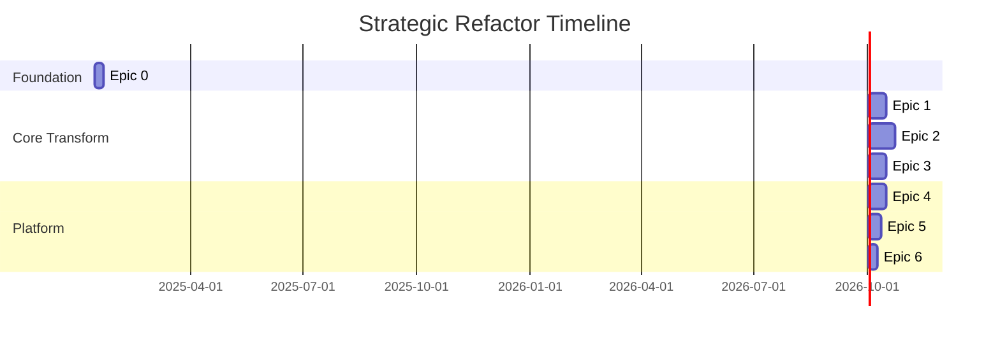

# Strategic Refactor Plan: Evolution to Pluggable Platform

**Version:** 1.0  
**Status:** DRAFT  
**Author:** Claude Code Analysis  
**Date:** 2025-01-13

## Executive Summary

This document outlines the strategic refactor plan to transform the current User Management System into the pluggable, enterprise-ready platform described in the PRD and Architecture documents. This is not a "fix bugs" effort - this is a **strategic evolution** that preserves valuable business logic while building the proper technical foundation.

## Current State Assessment

### What We Keep (High Value Assets)
- ✅ **Business Logic**: Authentication, authorization, multi-tenancy patterns
- ✅ **Architectural Patterns**: Adapter pattern, service layer separation  
- ✅ **Test Infrastructure**: 363 test files, comprehensive E2E framework
- ✅ **Domain Knowledge**: Complex permission systems, GDPR compliance
- ✅ **Documentation**: Clear vision and requirements

### What We Transform (Technical Debt)
- 🔄 **Type Safety**: 3,838 `any` types → Strict TypeScript
- 🔄 **Build System**: Timeout issues → Optimized monorepo builds
- 🔄 **Component Architecture**: Mixed concerns → Clean three-tier system
- 🔄 **API Layer**: REST routes → tRPC procedures
- 🔄 **Deployment Model**: Single app → Pluggable platform + SDK

## Refactor Philosophy

### Core Principles
1. **Extract, Don't Rewrite**: Preserve working business logic
2. **Type-First Architecture**: Build new components with strict TypeScript
3. **Incremental Migration**: Maintain working system throughout
4. **Testing Continuity**: Keep tests passing during transformation
5. **Documentation-Driven**: Update docs before code changes

### Success Criteria
- Zero regression in existing functionality
- 95%+ TypeScript strict mode compliance
- Sub-30 second build times
- All E2E tests passing
- Clear integration path for host applications

---

## Epic Structure Overview



**Total Timeline: ~12 weeks**  
**Parallel Work Possible: Some epics can overlap**

---

# Epic 0: Foundation Stabilization
**Duration:** 1 week  
**Priority:** Critical - Must complete before other work

## Objective
Create a stable foundation by fixing critical blockers without major architectural changes. This epic focuses on making the current system reliable enough to safely refactor.

### Scope
- Fix critical security vulnerabilities
- Restore TypeScript compilation
- Fix E2E test framework
- Resolve build performance issues
- Address only blocking issues, not comprehensive cleanup

### Success Criteria
- [ ] `npm audit` shows no critical/high vulnerabilities
- [ ] `npm run build` completes in <60 seconds
- [ ] `npx playwright test --list` works without errors
- [ ] `npx tsc --noEmit` runs without fatal errors
- [ ] All existing tests that were passing continue to pass

### Tasks

#### T0.1: Security Patch (1 day)
```bash
# Update critical security dependencies
npm audit fix
npm update @simplewebauthn/browser @simplewebauthn/server
npm update form-data xlsx

# Verify no new vulnerabilities introduced
npm audit --audit-level=moderate
```

#### T0.2: Build System Stabilization (2 days)
```typescript
// Fix critical dependency issues in config
// Resolve Prisma ESM import problems
// Address circular dependencies in telemetry system
// Optimize build performance bottlenecks
```

#### T0.3: E2E Test Framework Repair (2 days)
```bash
# Fix playwright configuration
# Resolve module import issues
# Ensure test database connection works
# Verify at least one E2E test can run
```

#### T0.4: TypeScript Compilation Fix (2 days)
```typescript
// Fix only fatal TypeScript errors that block builds
// Add missing JSX namespace declarations
// Resolve critical interface mismatches
// Maintain existing any types for now (Epic 2 will address)
```

### Deliverables
- All CI builds pass
- Documentation of fixes applied
- Baseline metrics for build times and test execution
- Risk assessment for proceeding to Epic 1

---

# Epic 1: Monorepo Transformation
**Duration:** 2 weeks  
**Priority:** High - Foundation for all other work

## Objective
Transform the single Next.js application into a pnpm workspaces monorepo structure that supports the pluggable architecture vision.

### Scope
- Create monorepo structure with workspaces
- Extract shared configuration packages
- Set up inter-package dependency management
- Maintain existing functionality during transition

### Target Structure
```
/apps
  /user-mgmt           # Main Next.js app (current codebase)
  /example-host        # Integration example app
/packages
  /pump-config         # Shared configs (tsconfig, eslint, etc.)
  /pump-types          # Shared TypeScript types
  /pump-utils          # Shared utilities
  /pump-testing        # Shared test utilities
```

### Success Criteria
- [ ] pnpm workspaces properly configured
- [ ] All packages can be built independently
- [ ] Existing application works unchanged
- [ ] CI/CD pipeline updated for monorepo
- [ ] Clear package dependency graph

### Tasks

#### T1.1: Monorepo Setup (3 days)
```json
// Root package.json
{
  "workspaces": [
    "apps/*",
    "packages/*"
  ]
}
```

#### T1.2: Configuration Extraction (3 days)
```bash
# Extract to packages/pump-config/
- tsconfig.base.json
- eslint.config.js
- prettier.config.js
- vitest.config.base.ts
- tailwind.config.base.js
```

#### T1.3: Type System Foundation (4 days)
```typescript
// packages/pump-types/src/
- core/          # Business domain types
- api/           # API contract types  
- ui/            # Component prop types
- config/        # Configuration types
```

#### T1.4: Shared Utilities (3 days)
```typescript
// packages/pump-utils/src/
- validation/    # Zod schemas
- formatters/    # Date, currency, etc.
- constants/     # Static values
- helpers/       # Pure functions
```

#### T1.5: Build System Integration (1 day)
```bash
# Update all build scripts for monorepo
# Configure cross-package type checking
# Set up dependency caching
```

### Deliverables
- Working monorepo with all packages
- Updated CI/CD configuration
- Package interdependency documentation
- Migration guide for developers

---

# Epic 2: Component Library Extraction
**Duration:** 3 weeks  
**Priority:** High - Core of pluggable architecture

## Objective
Extract UI components into the three-tier architecture (primitives → headless → styled) with strict TypeScript and proper separation of concerns.

### Scope
- Create the three-tier component library structure
- Extract existing components with proper typing
- Implement design token system
- Build theme provider infrastructure

### Target Packages
```
/packages
  /pump-primitives     # Atoms & molecules (Button, Input, Card)
  /pump-headless       # Logic-only components with render props
  /pump-styled         # Full compositions using primitives + headless
  /pump-theme          # Design tokens, CSS variables, ThemeProvider
  /pump-icons          # Icon library management
```

### Success Criteria
- [ ] All UI components have strict TypeScript
- [ ] Clear separation: headless = logic, styled = presentation
- [ ] Theme system supports light/dark modes
- [ ] Host applications can override any visual aspect
- [ ] Zero `any` types in component library packages
- [ ] Comprehensive Storybook documentation

### Tasks

#### T2.1: Design Token System (4 days)
```typescript
// packages/pump-theme/src/tokens/
export const tokens = {
  colors: {
    primary: { light: '#2563EB', dark: '#3B82F6' },
    background: { light: '#FFFFFF', dark: '#111827' }
  },
  spacing: { xs: '0.25rem', sm: '0.5rem', md: '1rem' },
  typography: { sans: 'Inter, sans-serif' }
}
```

#### T2.2: Primitive Components (5 days)
```typescript
// packages/pump-primitives/src/
- Button/       # All button variants, strict props
- Input/        # Form inputs with validation
- Card/         # Container components  
- Table/        # Data display
- Dialog/       # Modal patterns
```

#### T2.3: Headless Components (6 days)
```typescript
// packages/pump-headless/src/
- auth/         # Login flow logic
- forms/        # Form state management
- data/         # Search, filtering, pagination
- navigation/   # Route and state management
```

#### T2.4: Styled Compositions (4 days)
```typescript
// packages/pump-styled/src/
- LoginForm/    # Complete auth forms
- DataTable/    # Full data management
- Dashboard/    # Layout compositions
- Settings/     # User preference UIs
```

#### T2.5: Theme Provider System (2 days)
```typescript
// Runtime theme switching
const { mode, setMode, toggle } = useColorMode();
// CSS variable injection
// Host application override patterns
```

### Deliverables
- Three complete component packages
- Storybook documentation site
- Theme customization guide
- Integration examples for host apps
- Performance benchmarks

---

# Epic 3: tRPC Migration
**Duration:** 2 weeks  
**Priority:** High - API modernization

## Objective
Replace existing REST API routes with tRPC procedures for end-to-end type safety and better developer experience.

### Scope
- Set up tRPC server and client infrastructure
- Migrate existing API routes to tRPC procedures
- Implement proper error handling and validation
- Maintain backward compatibility during transition

### Success Criteria
- [ ] All API endpoints available as tRPC procedures
- [ ] End-to-end type safety from DB to UI
- [ ] Proper error handling with typed errors
- [ ] API documentation auto-generated from types
- [ ] Performance equivalent or better than REST

### Tasks

#### T3.1: tRPC Infrastructure (3 days)
```typescript
// apps/user-mgmt/src/server/trpc/
- context.ts     # Request context setup
- router.ts      # Main tRPC router
- procedures/    # Reusable procedure factories
```

#### T3.2: Auth Procedures (3 days)
```typescript
// Migrate auth routes to tRPC
export const authRouter = router({
  login: publicProcedure
    .input(loginSchema)
    .mutation(async ({ input, ctx }) => { ... }),
  register: publicProcedure
    .input(registerSchema)
    .mutation(async ({ input, ctx }) => { ... })
});
```

#### T3.3: User Management Procedures (3 days)
```typescript
// Profile, settings, permissions
export const userRouter = router({
  getProfile: protectedProcedure
    .query(async ({ ctx }) => { ... }),
  updateProfile: protectedProcedure
    .input(profileUpdateSchema)
    .mutation(async ({ input, ctx }) => { ... })
});
```

#### T3.4: Admin Procedures (2 days)
```typescript
// Admin functionality
export const adminRouter = router({
  listUsers: adminProcedure
    .input(userListSchema)
    .query(async ({ input, ctx }) => { ... })
});
```

#### T3.5: Client Integration (3 days)
```typescript
// Update frontend to use tRPC client
const { data, isLoading } = trpc.user.getProfile.useQuery();
const updateProfile = trpc.user.updateProfile.useMutation();
```

### Deliverables
- Complete tRPC API implementation
- Type-safe client SDK
- API documentation site
- Migration guide from REST
- Performance comparison report

---

# Epic 4: SDK Creation
**Duration:** 2 weeks  
**Priority:** Medium - External integration

## Objective
Create a client SDK that allows host applications to integrate the user management platform seamlessly.

### Scope
- Build JavaScript/TypeScript SDK for host applications
- Create React hooks for common operations  
- Implement authentication token management
- Provide configuration and theming options

### Success Criteria
- [ ] SDK works with any React/Next.js application
- [ ] Simple integration (< 10 lines of code to get started)
- [ ] Automatic token management and refresh
- [ ] TypeScript support with full IntelliSense
- [ ] Comprehensive documentation and examples

### Tasks

#### T4.1: Core SDK Package (4 days)
```typescript
// packages/pump-sdk/src/
- client/        # API client wrapper
- auth/          # Token management
- config/        # SDK configuration
- types/         # Public API types
```

#### T4.2: React Integration (3 days)
```typescript
// packages/pump-react/src/
export const PumpProvider = ({ config, children }) => { ... };
export const useAuth = () => { ... };
export const useProfile = () => { ... };
```

#### T4.3: Integration Examples (3 days)
```bash
# Create example applications showing integration
/apps/example-host-nextjs/
/apps/example-host-vite/
/apps/example-host-remix/
```

#### T4.4: Documentation & Guides (4 days)
```markdown
# SDK documentation
- Quick start guide
- API reference
- Integration patterns
- Theming guide
- Migration examples
```

### Deliverables
- Published npm packages (@pump/sdk, @pump/react)
- Integration documentation
- Example applications
- Developer onboarding guide

---

# Epic 5: Platform Integration
**Duration:** 1.5 weeks  
**Priority:** Medium - Deployment model

## Objective
Implement the hybrid subdomain + SDK deployment model that allows the platform to be used both as a standalone service and as an integrated component.

### Scope
- Set up subdomain deployment infrastructure
- Create integration templates for common frameworks
- Implement cross-domain authentication flows
- Build monitoring and analytics integration

### Success Criteria
- [ ] Platform deployable on subdomains (auth.example.com)
- [ ] Seamless authentication flow between host and platform
- [ ] Integration works with major frameworks
- [ ] Monitoring and error tracking integrated
- [ ] Performance monitoring in place

### Tasks

#### T5.1: Subdomain Architecture (3 days)
```typescript
// Configure Next.js for subdomain deployment
// Set up cross-domain session management
// Implement iframe integration patterns
```

#### T5.2: Authentication Bridge (3 days)
```typescript
// Cross-domain authentication flows
// Token exchange mechanisms
// Session synchronization
```

#### T5.3: Framework Integration Templates (4 days)
```bash
# Integration templates for:
- Next.js applications
- React SPAs
- Vue.js applications
- Vanilla JavaScript
```

#### T5.4: Monitoring Integration (1 day)
```typescript
// Error tracking setup
// Performance monitoring
// Usage analytics
```

### Deliverables
- Deployment documentation
- Integration templates
- Monitoring dashboard
- Performance benchmarks

---

# Epic 6: Documentation & Launch Preparation
**Duration:** 1 week  
**Priority:** Medium - Go-to-market readiness

## Objective
Create comprehensive documentation and prepare the platform for external use and potential commercialization.

### Scope
- Complete developer documentation
- Create marketing website
- Prepare open-source licensing
- Set up community support infrastructure

### Success Criteria
- [ ] Complete developer documentation
- [ ] Marketing website with clear value proposition
- [ ] Open-source repository ready for public release
- [ ] Community support channels established
- [ ] Pricing and packaging strategy defined

### Tasks

#### T6.1: Developer Documentation (3 days)
```markdown
# Complete documentation site
- API reference
- Integration guides
- Best practices
- Troubleshooting
- FAQ
```

#### T6.2: Marketing Website (2 days)
```html
<!-- Landing page with clear value proposition -->
- Feature overview
- Integration examples
- Pricing information
- Getting started guide
```

#### T6.3: Open Source Preparation (1 day)
```bash
# Prepare for public release
- License files
- Contributing guidelines  
- Code of conduct
- Issue templates
```

#### T6.4: Community Infrastructure (1 day)
```bash
# Set up community support
- Discord/Slack community
- GitHub discussions
- Documentation feedback
```

### Deliverables
- Documentation website
- Marketing landing page
- Open-source repository
- Community guidelines
- Launch announcement plan

---

## Risk Assessment & Mitigation

### High Risk Areas
1. **Type Safety Migration** - 3,838 any types to fix
   - *Mitigation*: Focus on new packages first, gradual migration
2. **E2E Test Stability** - Complex test suite to maintain
   - *Mitigation*: Fix incrementally, maintain working subset
3. **Performance Regression** - Build and runtime performance
   - *Mitigation*: Continuous benchmarking, performance budgets

### Medium Risk Areas
1. **API Breaking Changes** - tRPC migration impact
   - *Mitigation*: Maintain REST endpoints during transition
2. **Theme System Complexity** - CSS variable management
   - *Mitigation*: Start simple, iterate based on feedback

### Success Factors
1. **Incremental Approach** - Keep system working throughout
2. **Test-Driven Migration** - Tests validate each transformation
3. **Documentation First** - Clear specifications before implementation
4. **Performance Monitoring** - Continuous measurement and optimization

## Conclusion

This strategic refactor plan transforms your current codebase into the enterprise-ready, pluggable platform described in your vision documents. By preserving valuable business logic while rebuilding the technical foundation, you'll have a product ready for both internal use and external commercialization.

The 12-week timeline is aggressive but achievable with focused execution and the strong architectural foundation you've already built.